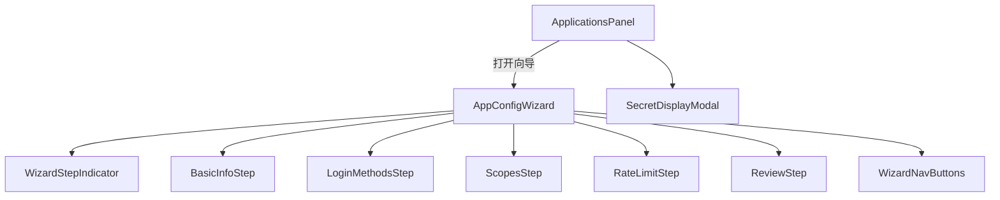
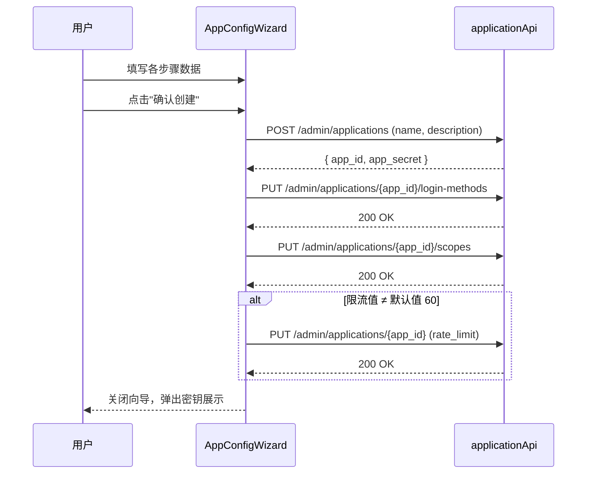

# 设计文档：应用配置向导 (App Config Wizard)

## 概述

本功能将 `ApplicationsPanel.tsx` 中现有的简单"新建应用"弹窗替换为一个五步向导（Step Wizard）。向导以 Ant Design `Drawer` 形式打开，内嵌 `Steps` 组件引导管理员依次完成：基本信息 → 登录方式 → 权限范围 → 限流配置 → 确认创建。最终提交时，前端按顺序编排多个已有 API 调用（创建应用 → 配置登录方式 → 配置权限范围 → 更新限流），成功后弹出密钥展示弹窗。

这是一个纯前端功能，不涉及后端改动。所有 API 端点已存在于 `services/admin/main.py`（端口 8007），前端 API 客户端已封装在 `admin-ui/src/api/services.ts` 的 `applicationApi` 中。

### 设计决策

| 决策 | 选择 | 理由 |
|------|------|------|
| 向导容器 | Drawer（抽屉） | 五步表单内容较多，Drawer 提供更大的展示空间，且不遮挡主页面 |
| 状态管理 | React useState + 聚合状态对象 | 项目未引入状态管理库，保持一致性；单一状态对象便于步骤间数据共享和最终提交 |
| 表单验证 | Ant Design Form + 自定义校验 | 复用项目已有模式，Step 1/2/4 需要在"下一步"时触发验证 |
| API 编排 | 顺序 async/await | 后续 API 依赖创建 API 返回的 app_id，必须串行执行 |
| 测试框架 | Vitest + React Testing Library + fast-check | Vitest 与 Vite 生态一致，fast-check 提供 TypeScript 原生的属性测试支持 |

## 架构

### 组件层级



### 数据流



## 组件与接口

### 1. AppConfigWizard

向导主组件，管理步骤状态和聚合数据。

```typescript
interface AppConfigWizardProps {
  open: boolean;
  onClose: () => void;
  onSuccess: (secretInfo: { appId: string; appSecret: string }) => void;
  userId: string;
}
```

职责：
- 渲染 Drawer 容器和 Steps 指示器
- 维护 `currentStep` 和 `wizardData` 状态
- 协调各步骤组件的数据收集
- 执行最终 API 编排提交
- 处理提交过程中的错误

### 2. BasicInfoStep

```typescript
interface BasicInfoStepProps {
  data: { name: string; description: string };
  onChange: (data: { name: string; description: string }) => void;
  formRef: React.RefObject<FormInstance>;
}
```

职责：
- 渲染应用名称（必填）和描述输入框
- 通过 Ant Design Form 进行字段验证
- 暴露 formRef 供父组件在"下一步"时触发 `validateFields()`

### 3. LoginMethodsStep

```typescript
interface LoginMethodConfig {
  method: string;
  is_enabled: boolean;
  client_id: string;
  client_secret: string;
}

interface LoginMethodsStepProps {
  data: LoginMethodConfig[];
  onChange: (data: LoginMethodConfig[]) => void;
  formRef: React.RefObject<FormInstance>;
}
```

职责：
- 渲染六种登录方式的 Switch 开关
- OAuth 方式启用时展开 Client ID / Client Secret 输入区域
- 禁用 OAuth 方式时收起输入区域
- 验证已启用的 OAuth 方式必须填写 Client ID

### 4. ScopesStep

```typescript
interface ScopesStepProps {
  data: string[];
  onChange: (scopes: string[]) => void;
}
```

职责：
- 以 Checkbox.Group 展示八个权限范围选项
- 全部可选，无必填约束

### 5. RateLimitStep

```typescript
interface RateLimitStepProps {
  data: number;
  onChange: (value: number) => void;
  formRef: React.RefObject<FormInstance>;
}
```

职责：
- 渲染 InputNumber 控件，范围 1-100000，默认值 60
- 验证输入值在有效范围内

### 6. ReviewStep

```typescript
interface ReviewStepProps {
  wizardData: WizardData;
}
```

职责：
- 只读展示所有步骤的配置汇总
- OAuth 方式的 Client Secret 以掩码展示
- 未配置的项目显示"未配置"提示

### 7. SecretDisplayModal

复用现有 `ApplicationsPanel.tsx` 中的密钥展示弹窗逻辑，提取为独立组件。

```typescript
interface SecretDisplayModalProps {
  open: boolean;
  appId: string;
  appSecret: string;
  onClose: () => void;
}
```

### 8. API 编排函数

```typescript
async function submitWizard(
  data: WizardData,
  userId: string
): Promise<{ appId: string; appSecret: string }>
```

纯函数，按顺序调用 API：
1. `applicationApi.create({ name, description }, userId)` → 获取 `app_id` 和 `app_secret`
2. `applicationApi.updateLoginMethods(appId, { login_methods }, userId)`
3. `applicationApi.updateScopes(appId, { scopes }, userId)`
4. 若 `rate_limit !== 60`：`applicationApi.update(appId, { rate_limit }, userId)`

将此逻辑提取为独立函数便于单元测试和属性测试。

## 数据模型

### WizardData（向导聚合状态）

```typescript
interface WizardData {
  // Step 1: 基本信息
  basicInfo: {
    name: string;
    description: string;
  };
  // Step 2: 登录方式
  loginMethods: LoginMethodConfig[];
  // Step 3: 权限范围
  scopes: string[];
  // Step 4: 限流
  rateLimit: number;
}
```

### 初始状态

```typescript
const INITIAL_WIZARD_DATA: WizardData = {
  basicInfo: { name: '', description: '' },
  loginMethods: [
    { method: 'email', is_enabled: false, client_id: '', client_secret: '' },
    { method: 'phone', is_enabled: false, client_id: '', client_secret: '' },
    { method: 'wechat', is_enabled: false, client_id: '', client_secret: '' },
    { method: 'alipay', is_enabled: false, client_id: '', client_secret: '' },
    { method: 'google', is_enabled: false, client_id: '', client_secret: '' },
    { method: 'apple', is_enabled: false, client_id: '', client_secret: '' },
  ],
  scopes: [],
  rateLimit: 60,
};
```

### 常量定义

```typescript
const WIZARD_STEPS = [
  { title: '基本信息', key: 'basicInfo' },
  { title: '登录方式', key: 'loginMethods' },
  { title: '权限范围', key: 'scopes' },
  { title: '限流配置', key: 'rateLimit' },
  { title: '确认创建', key: 'review' },
] as const;

const ALL_LOGIN_METHODS = ['email', 'phone', 'wechat', 'alipay', 'google', 'apple'] as const;
const OAUTH_METHODS = new Set(['wechat', 'alipay', 'google', 'apple']);
const ALL_SCOPES = [
  'user:read', 'user:write', 'auth:login', 'auth:register',
  'role:read', 'role:write', 'org:read', 'org:write',
] as const;
```


## 正确性属性 (Correctness Properties)

*属性是指在系统所有有效执行中都应成立的特征或行为——本质上是对系统应做什么的形式化陈述。属性是人类可读规格说明与机器可验证正确性保证之间的桥梁。*

### 属性 1：关闭向导重置状态

*对于任意* WizardData 状态（包含任意有效的名称、描述、登录方式配置、权限范围选择和限流值），关闭向导后重新打开，所有字段应恢复为初始默认值。

**验证需求：1.3**

### 属性 2：应用名称验证

*对于任意* 字符串，若该字符串为空或仅由空白字符组成，则基本信息步骤应阻止进入下一步；若该字符串包含至少一个非空白字符，则应允许进入下一步。

**验证需求：2.3, 2.4**

### 属性 3：OAuth 开关可见性联动

*对于任意* OAuth 登录方式（微信、支付宝、Google、Apple），启用该方式时应展示 Client ID 和 Client Secret 输入区域；禁用该方式时应隐藏这些输入区域。

**验证需求：3.2, 3.3**

### 属性 4：OAuth Client ID 必填验证

*对于任意* 已启用的 OAuth 登录方式，若其 Client ID 为空，则登录方式步骤应阻止进入下一步并展示验证错误。

**验证需求：3.4**

### 属性 5：权限范围选择状态同步

*对于任意* 八个权限范围的子集组合，勾选该子集后，WizardData 中的 scopes 数组应恰好包含且仅包含该子集中的元素。

**验证需求：4.3**

### 属性 6：限流值范围验证

*对于任意* 整数值，若该值在 [1, 100000] 范围内，则限流配置步骤应接受该值并允许进入下一步；若该值超出此范围，则应阻止进入下一步并展示验证错误。

**验证需求：5.3, 5.4**

### 属性 7：确认步骤数据完整性

*对于任意* 有效的 WizardData，确认步骤的渲染输出应包含：应用名称、应用描述（若非空）、所有已启用登录方式的名称、已启用 OAuth 方式的 Client ID（Client Secret 以掩码形式展示）、所有已选择的权限范围、以及限流配置值。

**验证需求：6.1, 6.2**

### 属性 8：步骤导航状态保持

*对于任意* WizardData 状态和任意当前步骤 N（N > 0），执行"上一步"操作后，WizardData 中所有步骤的数据应与操作前完全一致。

**验证需求：7.4, 7.5**

### 属性 9：步骤指示器导航约束

*对于任意* 当前步骤 N 和目标步骤 M，若 M < N 则点击步骤指示器应跳转到步骤 M；若 M > N 则点击步骤指示器不应发生跳转。

**验证需求：7.6**

### 属性 10：API 编排正确性

*对于任意* 有效的 WizardData，提交时应始终首先调用创建应用 API；创建成功后应调用登录方式配置 API 和权限范围配置 API；当且仅当限流值不等于默认值 60 时，应额外调用更新应用 API。

**验证需求：8.1, 8.2, 8.3**

### 属性 11：错误信息展示保真

*对于任意* API 返回的错误信息字符串，向导应将该错误信息原样展示给用户；若创建 API 失败，向导应保持打开状态；若创建成功但后续 API 失败，向导应提示用户前往详情页完成配置。

**验证需求：10.1, 10.2**

## 错误处理

### 错误场景与处理策略

| 错误场景 | 处理方式 | 向导状态 |
|----------|----------|----------|
| 创建应用 API 失败 | 展示后端错误信息（`err.response.data.detail`），允许修改重试 | 保持打开，停留在确认步骤 |
| 创建成功，登录方式/权限范围 API 失败 | 展示提示："应用已创建，但部分配置未成功，请前往详情页手动完成配置" | 关闭向导，展示密钥，刷新列表 |
| 创建成功，限流 API 失败 | 同上，限流使用默认值 60 | 关闭向导，展示密钥，刷新列表 |
| 网络中断 | 展示"网络连接异常，请检查网络后重试" | 保持打开 |
| 表单验证失败 | 各步骤内联展示验证错误，阻止步骤跳转 | 停留在当前步骤 |

### 错误处理实现要点

- 使用 try/catch 包裹每个 API 调用，区分创建失败和后续配置失败
- 创建 API 失败时，不调用后续 API，直接展示错误
- 后续 API 失败时，仍然展示密钥（因为应用已创建成功），同时附加警告信息
- 网络错误通过检查 `err.message` 包含 "Network Error" 来识别
- 使用 Ant Design `message.error()` 展示错误提示

## 测试策略

### 测试框架

- **单元测试 / 组件测试**: Vitest + React Testing Library
- **属性测试**: fast-check（TypeScript 原生属性测试库）
- 需要在 `admin-ui` 项目中添加以下开发依赖：
  - `vitest`
  - `@testing-library/react`
  - `@testing-library/jest-dom`
  - `@testing-library/user-event`
  - `fast-check`
  - `jsdom`

### 单元测试（示例与边界情况）

| 测试用例 | 验证需求 |
|----------|----------|
| 点击"新建应用"按钮打开 Drawer | 1.1 |
| 向导打开时展示五个步骤标题 | 1.2 |
| 基本信息步骤包含名称和描述输入框 | 2.1, 2.2 |
| 六种登录方式开关全部展示 | 3.1 |
| 不启用任何登录方式可进入下一步 | 3.5 |
| 八个权限范围复选框全部展示 | 4.1 |
| 不选择任何权限范围可进入下一步 | 4.2 |
| 限流默认值为 60 | 5.2 |
| 第一步隐藏"上一步"按钮 | 7.2 |
| 最后一步显示"确认创建"按钮 | 7.3 |
| 提交时按钮显示加载状态 | 8.4 |
| 成功后关闭向导并刷新列表 | 8.5 |
| 密钥弹窗展示 App ID 和 App Secret | 9.1 |
| 密钥弹窗展示警告信息 | 9.2 |
| 密钥弹窗提供复制功能 | 9.3 |
| 点击"我已保存"关闭密钥弹窗 | 9.4 |
| 未配置登录方式时确认步骤显示"未配置" | 6.3 |
| 未选择权限范围时确认步骤显示"未配置" | 6.4 |
| 网络错误展示网络错误提示 | 10.3 |

### 属性测试

每个属性测试必须：
- 使用 fast-check 库
- 最少运行 100 次迭代
- 以注释标注对应的设计属性

| 属性测试 | 对应属性 | 标签 |
|----------|----------|------|
| 关闭向导后状态重置 | 属性 1 | Feature: app-config-wizard, Property 1: 关闭向导重置状态 |
| 应用名称验证（空白 vs 有效） | 属性 2 | Feature: app-config-wizard, Property 2: 应用名称验证 |
| OAuth 开关与输入区域联动 | 属性 3 | Feature: app-config-wizard, Property 3: OAuth 开关可见性联动 |
| OAuth Client ID 必填校验 | 属性 4 | Feature: app-config-wizard, Property 4: OAuth Client ID 必填验证 |
| 权限范围选择与状态同步 | 属性 5 | Feature: app-config-wizard, Property 5: 权限范围选择状态同步 |
| 限流值范围校验 | 属性 6 | Feature: app-config-wizard, Property 6: 限流值范围验证 |
| 确认步骤渲染完整性 | 属性 7 | Feature: app-config-wizard, Property 7: 确认步骤数据完整性 |
| 步骤导航不丢失数据 | 属性 8 | Feature: app-config-wizard, Property 8: 步骤导航状态保持 |
| 步骤指示器点击约束 | 属性 9 | Feature: app-config-wizard, Property 9: 步骤指示器导航约束 |
| API 调用编排顺序与条件 | 属性 10 | Feature: app-config-wizard, Property 10: API 编排正确性 |
| 错误信息原样展示 | 属性 11 | Feature: app-config-wizard, Property 11: 错误信息展示保真 |
