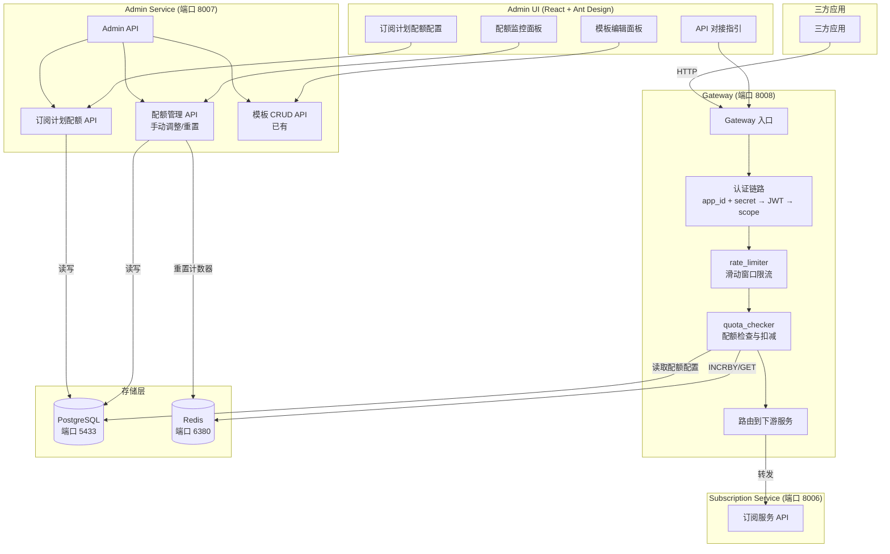
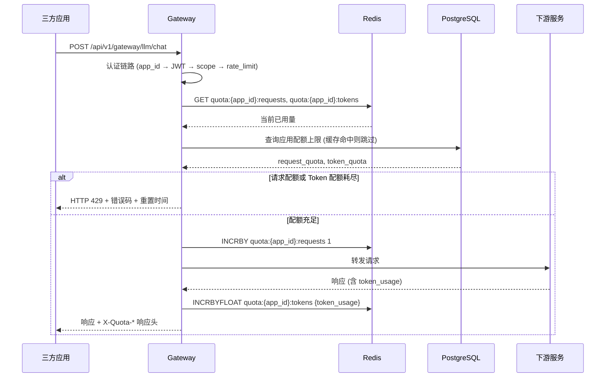

# 技术设计文档：大模型配额管理（LLM Quota Management）

## 概述

本设计为统一身份认证平台新增大模型配额管理能力，覆盖三大模块：

1. **配额核心引擎**（需求 1-10）：在 SubscriptionPlan 上扩展配额字段，通过 Gateway 中间件实现请求级/Token 级配额检查与扣减，使用 Redis 原子计数器保证高并发性能，PostgreSQL 持久化历史使用记录，Admin UI 提供监控面板和手动调整能力。
2. **消息模板前端编辑器**（需求 11）：后端 API 已完备（`/api/v1/admin/templates` CRUD），仅需开发 Admin UI 中的模板管理面板，包含 Jinja2 变量辅助插入和实时预览。
3. **配额查询 API + 前端对接指引**（需求 12）：在 Gateway 新增 `GET /api/v1/quota/usage` 端点，扩展 IntegrationGuide 和 SecretDisplayModal 增加配额 API 文档。

### 设计原则

- **最小侵入**：复用现有 Gateway 认证链路（app_id + app_secret → JWT → scope → rate_limit），在 rate_limit 之后插入 quota_check 中间件
- **读写分离**：Redis 承担实时计数器的读写，PostgreSQL 仅在周期结束时批量写入历史数据
- **优雅降级**：Redis 不可用时放行请求并记录告警，不阻塞业务
- **原子操作**：使用 Redis INCRBY/INCRBYFLOAT 保证并发安全

## 架构

### 系统架构图



### 请求处理流程



## 组件与接口

### 1. 数据库模型扩展

#### SubscriptionPlan 扩展字段

在现有 `shared/models/subscription.py` 的 `SubscriptionPlan` 模型上新增三个字段：

| 字段 | 类型 | 默认值 | 说明 |
|------|------|--------|------|
| `request_quota` | Integer | -1 | 每周期最大请求次数，-1 表示无限制 |
| `token_quota` | BigInteger | -1 | 每周期最大 Token 消耗量，-1 表示无限制 |
| `quota_period_days` | Integer | 30 | 配额重置周期（天） |

#### AppQuotaOverride 新模型

管理员手动调整的配额覆盖值，优先级高于订阅计划默认值：

```python
class AppQuotaOverride(Base):
    __tablename__ = "app_quota_overrides"

    id = Column(UUID, primary_key=True, default=uuid.uuid4)
    application_id = Column(UUID, ForeignKey('applications.id', ondelete='CASCADE'), unique=True)
    request_quota = Column(Integer, nullable=True)   # NULL 表示使用订阅计划默认值
    token_quota = Column(BigInteger, nullable=True)
    created_at = Column(DateTime, default=datetime.utcnow)
    updated_at = Column(DateTime, default=datetime.utcnow, onupdate=datetime.utcnow)
```

#### QuotaUsage 新模型

每个计费周期结束时持久化的使用记录：

```python
class QuotaUsage(Base):
    __tablename__ = "quota_usages"

    id = Column(UUID, primary_key=True, default=uuid.uuid4)
    application_id = Column(UUID, ForeignKey('applications.id', ondelete='CASCADE'), index=True)
    billing_cycle_start = Column(DateTime, nullable=False)
    billing_cycle_end = Column(DateTime, nullable=False)
    request_quota_limit = Column(Integer, nullable=False)
    request_quota_used = Column(Integer, nullable=False)
    token_quota_limit = Column(BigInteger, nullable=False)
    token_quota_used = Column(BigInteger, nullable=False)
    reset_type = Column(String(20), nullable=False)  # auto / manual
    created_at = Column(DateTime, default=datetime.utcnow)
```

### 2. Gateway 配额检查模块 (`services/gateway/quota_checker.py`)

核心模块，负责配额的检查、扣减和响应头注入。

#### Redis Key 设计

```
quota:{app_id}:requests          # 当前周期请求次数计数器 (String, INCRBY)
quota:{app_id}:tokens            # 当前周期 Token 消耗量计数器 (String, INCRBYFLOAT)
quota:{app_id}:cycle_start       # 当前计费周期开始时间 (String, ISO format)
quota:{app_id}:config            # 配额配置缓存 (Hash)
quota:{app_id}:warning_sent:80   # 80% 预警已发送标记 (String, 防重复)
quota:{app_id}:warning_sent:100  # 100% 耗尽已发送标记 (String, 防重复)
```

所有 key 设置 TTL = 剩余周期秒数 + 86400（一天安全余量）。

#### 接口定义

```python
@dataclass
class QuotaCheckResult:
    allowed: bool
    request_limit: int
    request_used: int
    request_remaining: int
    token_limit: int
    token_used: int
    token_remaining: int
    reset_timestamp: int          # Unix 时间戳
    error_code: Optional[str]     # request_quota_exceeded / token_quota_exceeded / quota_not_configured
    warning: Optional[str]        # approaching_limit / exhausted

    @property
    def headers(self) -> Dict[str, str]:
        """生成 X-Quota-* 响应头"""
        ...

async def check_quota(app_id: str) -> QuotaCheckResult:
    """检查应用配额（请求前调用）"""
    ...

async def deduct_request_quota(app_id: str) -> None:
    """扣减请求次数配额（请求成功后调用）"""
    ...

async def deduct_token_quota(app_id: str, token_usage: int) -> QuotaCheckResult:
    """扣减 Token 配额并返回更新后的状态（下游响应后调用）"""
    ...

async def get_quota_usage(app_id: str) -> dict:
    """获取应用当前配额使用情况（供 /api/v1/quota/usage 端点使用）"""
    ...
```

#### 降级策略

```python
async def check_quota(app_id: str) -> QuotaCheckResult:
    try:
        redis = get_redis()
        # ... 正常检查逻辑
    except (redis.ConnectionError, redis.TimeoutError) as e:
        logger.warning("Redis 不可用，配额检查降级放行: %s", str(e))
        return QuotaCheckResult(allowed=True, ...)  # 降级放行
```

### 3. Gateway 端点扩展

#### 大模型 API 代理端点

在 `services/gateway/main.py` 中新增大模型 API 代理端点，在现有认证链路之后插入配额检查：

```python
@app.post("/api/v1/gateway/llm/{path:path}")
async def gateway_llm_proxy(path: str, request: Request):
    """大模型 API 代理端点，含配额检查与扣减"""
    app_data = await _run_auth_pipeline(request, "", f"llm/{path}")

    # 配额检查（在 rate_limit 之后）
    quota_result = await check_quota(app_data["app_id"])
    if not quota_result.allowed:
        raise HTTPException(status_code=429, detail={...})

    # 扣减请求次数
    await deduct_request_quota(app_data["app_id"])

    # 转发到下游
    result = await router.forward("llm", "POST", f"/api/v1/llm/{path}", ...)

    # 扣减 Token（从下游响应中提取 token_usage）
    token_usage = result["body"].get("token_usage", 0)
    updated_quota = await deduct_token_quota(app_data["app_id"], token_usage)

    # 注入配额响应头
    response = JSONResponse(...)
    for k, v in updated_quota.headers.items():
        response.headers[k] = v
    return response
```

#### 配额查询端点

```python
@app.get("/api/v1/quota/usage")
async def quota_usage(request: Request):
    """配额查询端点（需求 12）"""
    app_data = await get_app_credential_from_request(request)
    # Bearer token 认证
    token = _extract_bearer_token(request)
    payload = _decode_bearer_token(token)
    # 从 Redis 读取实时数据
    usage = await get_quota_usage(app_data["app_id"])
    return usage
```

### 4. Admin Service 配额管理 API

在 `services/admin/main.py` 中新增以下端点：

| 方法 | 路径 | 说明 |
|------|------|------|
| GET | `/api/v1/admin/quota/overview` | 所有应用配额使用概览 |
| GET | `/api/v1/admin/quota/{app_id}` | 单个应用配额详情 |
| PUT | `/api/v1/admin/quota/{app_id}/override` | 手动调整应用配额上限 |
| POST | `/api/v1/admin/quota/{app_id}/reset` | 手动重置应用配额 |
| GET | `/api/v1/admin/quota/{app_id}/history` | 应用配额使用历史 |

### 5. 配额重置调度

使用与现有 `process_expired_subscriptions` 相同的模式，在 Subscription Service 中添加定时任务：

```python
async def process_quota_resets(db: Session) -> dict:
    """检查并重置到期的配额周期"""
    # 1. 查询所有活跃应用的配额配置
    # 2. 检查每个应用的当前周期是否已结束
    # 3. 持久化当前周期使用数据到 QuotaUsage
    # 4. 重置 Redis 计数器
    # 5. 更新周期开始时间
    ...
```

### 6. 配额超限通知

复用现有的 Webhook 推送机制（`services/subscription/webhook_handlers.py`）：

- 事件类型：`quota.warning`（80% 预警）、`quota.exhausted`（100% 耗尽）
- 通过 Redis 标记位防止同一周期内重复发送
- 在 Gateway 响应头中注入 `X-Quota-Warning: approaching_limit | exhausted`

### 7. Admin UI 新增面板

#### 7.1 配额监控面板 (`QuotaMonitorPanel.tsx`)

- 表格展示所有应用的配额使用概览
- Progress 组件展示请求次数和 Token 使用率
- 使用率 > 80% 黄色警告，= 100% 红色告警
- 支持按使用率排序

#### 7.2 订阅计划配额配置

扩展现有 `SubscriptionsPanel.tsx` 的创建/编辑表单，新增 `request_quota`、`token_quota`、`quota_period_days` 字段。

#### 7.3 消息模板编辑面板 (`MessageTemplatePanel.tsx`)

- 按类型（email/sms）分 Tab 展示
- 模板编辑器：名称、主题（邮件）、内容、变量说明
- Jinja2 变量插入辅助：点击变量名自动插入到光标位置
- 实时预览：输入示例变量值，调用 Jinja2 渲染展示效果
- 系统内置模板不可删除

#### 7.4 API 对接指引扩展

扩展 `IntegrationGuide.tsx` 和 `SecretDisplayModal.tsx`，新增配额管理 API 章节和响应头说明。

## 数据模型

### ER 图

```mermaid
erDiagram
    SubscriptionPlan {
        UUID id PK
        String name
        Text description
        Integer duration_days
        Numeric price
        JSONB features
        Boolean is_active
        Integer request_quota
        BigInteger token_quota
        Integer quota_period_days
    }

    Application {
        UUID id PK
        String app_id UK
        String name
        Integer rate_limit
    }

    AppSubscriptionPlan {
        UUID id PK
        UUID application_id FK
        UUID plan_id FK
    }

    AppQuotaOverride {
        UUID id PK
        UUID application_id FK UK
        Integer request_quota
        BigInteger token_quota
    }

    QuotaUsage {
        UUID id PK
        UUID application_id FK
        DateTime billing_cycle_start
        DateTime billing_cycle_end
        Integer request_quota_limit
        Integer request_quota_used
        BigInteger token_quota_limit
        BigInteger token_quota_used
        String reset_type
        DateTime created_at
    }

    MessageTemplate {
        UUID id PK
        String name UK
        String type
        String subject
        Text content
        JSONB variables
    }

    SubscriptionPlan ||--o{ AppSubscriptionPlan : "has"
    Application ||--o| AppSubscriptionPlan : "binds"
    Application ||--o| AppQuotaOverride : "overrides"
    Application ||--o{ QuotaUsage : "records"
```

### Redis 数据结构

| Key 模式 | 类型 | TTL | 说明 |
|----------|------|-----|------|
| `quota:{app_id}:requests` | String (int) | 周期剩余秒数 + 86400 | 当前周期请求次数计数器 |
| `quota:{app_id}:tokens` | String (float) | 同上 | 当前周期 Token 消耗量计数器 |
| `quota:{app_id}:cycle_start` | String (ISO datetime) | 同上 | 当前计费周期开始时间 |
| `quota:{app_id}:config` | Hash | 300s | 配额配置缓存（request_quota, token_quota, quota_period_days） |
| `quota:{app_id}:warning_sent:{level}` | String ("1") | 同周期 TTL | 预警/耗尽通知已发送标记 |

### 配额优先级规则

1. `AppQuotaOverride` 中的值（管理员手动调整）优先级最高
2. 若 `AppQuotaOverride` 对应字段为 NULL，则使用 `SubscriptionPlan` 的默认值
3. 若应用未绑定订阅计划，返回 `quota_not_configured` 错误

### 配额计算公式

```
effective_request_quota = app_quota_override.request_quota ?? subscription_plan.request_quota
effective_token_quota = app_quota_override.token_quota ?? subscription_plan.token_quota
request_remaining = max(0, effective_request_quota - redis_request_counter)
token_remaining = max(0, effective_token_quota - redis_token_counter)
```

当 `effective_*_quota == -1` 时，表示无限制，remaining 始终返回 -1。

## 正确性属性（Correctness Properties）

*属性（Property）是指在系统所有合法执行路径中都应成立的特征或行为——本质上是对系统应做什么的形式化陈述。属性是人类可读规格说明与机器可验证正确性保证之间的桥梁。*

### Property 1: 订阅计划配额字段持久化往返

*For any* SubscriptionPlan，设置 request_quota、token_quota 和 quota_period_days 后保存到数据库，再重新加载，三个字段的值应与保存前完全一致。

**Validates: Requirements 1.1, 1.2, 1.3**

### Property 2: 无限制配额始终放行

*For any* 应用，当其有效配额（request_quota 或 token_quota）为 -1 时，无论当前已使用量为多少，配额检查应始终返回 allowed=true。

**Validates: Requirements 1.5**

### Property 3: 非法配额值被拒绝

*For any* 整数值 v，当 v < -1 时，创建或更新 SubscriptionPlan 的 request_quota 或 token_quota 为 v 应被验证拒绝。

**Validates: Requirements 1.6**

### Property 4: 计划绑定初始化配额

*For any* 应用和任意 SubscriptionPlan，当应用绑定该计划后，应用的有效配额上限应等于该计划的 request_quota 和 token_quota（在无手动覆盖的情况下）。

**Validates: Requirements 2.1**

### Property 5: 计划升级立即生效且保留已用量

*For any* 应用，当其订阅计划从低配额升级到高配额时，有效配额上限应立即变为新计划的值，且已使用量保持不变。

**Validates: Requirements 2.2**

### Property 6: 计划降级延迟生效

*For any* 应用，当其订阅计划从高配额降级到低配额时，在当前计费周期内有效配额上限应保持为旧计划的值。

**Validates: Requirements 2.3**

### Property 7: 未绑定计划的应用被拒绝

*For any* 未绑定 SubscriptionPlan 的应用，配额检查应返回 allowed=false 且 error_code 为 quota_not_configured。

**Validates: Requirements 2.4**

### Property 8: 配额耗尽返回 429

*For any* 应用，当其请求次数剩余量为 0 或 Token 剩余量为 0 时，配额检查应返回 allowed=false，且 error_code 分别为 request_quota_exceeded 或 token_quota_exceeded，响应体中包含 reset_timestamp。

**Validates: Requirements 3.2, 4.1, 4.2**

### Property 9: 配额响应头完整性

*For any* QuotaCheckResult，其 headers 属性应包含以下全部 key：X-Quota-Request-Limit、X-Quota-Request-Remaining、X-Quota-Request-Reset、X-Quota-Token-Limit、X-Quota-Token-Remaining、X-Quota-Token-Reset。当存在预警时还应包含 X-Quota-Warning。

**Validates: Requirements 3.3, 3.4, 9.3**

### Property 10: 请求计数器精确递增

*For any* 应用和任意正整数 N，连续执行 N 次 deduct_request_quota 后，Redis 中的请求计数器值应恰好等于初始值 + N。

**Validates: Requirements 3.5**

### Property 11: Token 计数器按实际消耗递增

*For any* 应用和任意非负数序列 [t1, t2, ..., tn]，依次执行 deduct_token_quota(ti) 后，Redis 中的 Token 计数器值应等于初始值 + sum(t1..tn)。当下游响应不含 token_usage 字段时，扣减量为 0。

**Validates: Requirements 3.6, 4.3, 4.4**

### Property 12: Token 超额允许当次完成

*For any* 应用，当单次请求的 Token 消耗导致累计超过上限时，该次扣减操作应成功完成（不回滚），但后续配额检查应返回 token_quota_exceeded。

**Validates: Requirements 4.5**

### Property 13: 配额重置归零并持久化

*For any* 配额重置操作（自动或手动），重置后 Redis 中的请求计数器和 Token 计数器应为 0，且 PostgreSQL 的 QuotaUsage 表中应新增一条记录，其 request_quota_used 和 token_quota_used 等于重置前的计数器值。

**Validates: Requirements 5.4, 6.1, 6.2, 8.1, 8.2, 8.3, 10.2**

### Property 14: Redis Key TTL 正确性

*For any* 配额计数器 key，其 TTL 应等于当前计费周期剩余秒数 + 86400（±1 秒容差）。

**Validates: Requirements 5.5**

### Property 15: Redis 不可用时优雅降级

*For any* 配额检查请求，当 Redis 抛出 ConnectionError 或 TimeoutError 时，check_quota 应返回 allowed=true（降级放行）。

**Validates: Requirements 5.6**

### Property 16: 历史记录查询过滤正确性

*For any* 时间范围 [start, end] 和应用 ID 的组合，查询返回的 QuotaUsage 记录应满足：billing_cycle_start >= start AND billing_cycle_end <= end AND application_id == app_id。

**Validates: Requirements 6.3**

### Property 17: 使用率状态分级

*For any* 使用率百分比 p，当 p < 80 时状态为 normal，当 80 <= p < 100 时状态为 warning，当 p >= 100 时状态为 danger。

**Validates: Requirements 7.3, 7.4**

### Property 18: 使用率排序正确性

*For any* 应用配额使用列表，按请求次数使用率降序排列后，列表中每个元素的使用率应大于等于其后继元素的使用率。

**Validates: Requirements 7.5**

### Property 19: 配额变更审计日志完整性

*For any* 配额修改操作（手动重置或手动调整），应创建一条审计日志，包含 application_id、操作类型（reset/override）、操作前的值和操作后的值。

**Validates: Requirements 8.4, 10.4**

### Property 20: 阈值事件单次触发

*For any* 应用在同一计费周期内，80% 预警事件和 100% 耗尽事件各最多触发一次。即使使用量在阈值附近反复波动（如手动调整后），同一周期内不应重复触发。

**Validates: Requirements 9.1, 9.2**

### Property 21: 手动覆盖优先级

*For any* 应用，当 AppQuotaOverride 中设置了 request_quota 或 token_quota 时，有效配额应等于覆盖值而非 SubscriptionPlan 的默认值。当覆盖值为 NULL 时，应回退到计划默认值。

**Validates: Requirements 10.1**

### Property 22: 模板预览渲染正确性

*For any* Jinja2 模板和任意变量值映射，渲染结果应包含所有变量的替换值，且不包含未替换的 `{{ }}` 语法标记。

**Validates: Requirements 11.4**

### Property 23: 系统内置模板不可删除

*For any* 系统内置模板名称（email_verification、password_reset、subscription_reminder、email_verification_code），删除操作应被拒绝。对于非内置模板，删除操作应成功。

**Validates: Requirements 11.6**

### Property 24: 配额查询端点数据一致性

*For any* 应用，调用 `GET /api/v1/quota/usage` 返回的 request_quota_used 和 token_quota_used 应与 Redis 中对应计数器的当前值一致。

**Validates: Requirements 12.1, 12.6**

## 错误处理

### 错误码定义

| 错误码 | HTTP 状态码 | 触发条件 | 响应体 |
|--------|------------|----------|--------|
| `quota_not_configured` | 403 | 应用未绑定订阅计划 | `{"error_code": "quota_not_configured", "message": "应用未配置配额计划"}` |
| `request_quota_exceeded` | 429 | 请求次数配额耗尽 | `{"error_code": "request_quota_exceeded", "message": "请求次数配额已耗尽", "reset_at": "<ISO timestamp>"}` |
| `token_quota_exceeded` | 429 | Token 配额耗尽 | `{"error_code": "token_quota_exceeded", "message": "Token 配额已耗尽", "reset_at": "<ISO timestamp>"}` |
| `invalid_quota_value` | 400 | 配额值 < -1 | `{"error_code": "invalid_quota_value", "message": "配额值必须 >= -1"}` |

### 降级策略

| 故障场景 | 降级行为 | 日志级别 |
|----------|----------|----------|
| Redis 连接失败 | 放行请求，配额不扣减 | WARNING |
| Redis 超时 | 放行请求，配额不扣减 | WARNING |
| PostgreSQL 持久化失败 | Redis 计数器正常工作，下次重试持久化 | ERROR |
| 配额配置缓存未命中 | 从 PostgreSQL 重新加载并缓存 | INFO |

### 并发安全

- Redis INCRBY/INCRBYFLOAT 是原子操作，天然支持并发
- 配额检查和扣减使用 Redis Pipeline 减少网络往返
- 计费周期重置使用 Redis WATCH + MULTI 保证原子性

## 测试策略

### 双轨测试方法

本功能采用单元测试 + 属性测试（Property-Based Testing）双轨并行的测试策略。

#### 属性测试（Property-Based Testing）

- 使用 **Hypothesis** 库（Python PBT 标准库）
- 每个属性测试最少运行 **100 次迭代**
- 每个测试用注释标注对应的设计属性编号
- 标注格式：`# Feature: llm-quota-management, Property {N}: {property_text}`

属性测试重点覆盖：
- 配额检查核心逻辑（Property 2, 7, 8, 12, 15, 17）
- 计数器原子递增（Property 10, 11）
- 配额重置与持久化（Property 13）
- 配额优先级计算（Property 21）
- 模板渲染（Property 22）
- 数据往返（Property 1, 24）

#### 单元测试

单元测试聚焦于具体示例、边界条件和集成点：
- 具体的 API 端点请求/响应验证
- Redis 不可用时的降级行为
- 管理员手动调整的审计日志
- 前端组件渲染（使用 React Testing Library）
- 内置模板删除保护

#### 测试文件规划

| 测试文件 | 覆盖范围 |
|----------|----------|
| `tests/test_quota_checker.py` | quota_checker 模块核心逻辑 |
| `tests/test_quota_checker_properties.py` | 配额检查属性测试（Property 2, 7, 8, 10, 11, 12, 15, 17, 21） |
| `tests/test_quota_reset.py` | 配额重置与持久化 |
| `tests/test_quota_reset_properties.py` | 重置属性测试（Property 13, 14, 20） |
| `tests/test_quota_admin_api.py` | Admin 配额管理 API |
| `tests/test_quota_admin_properties.py` | Admin API 属性测试（Property 3, 4, 5, 6, 16, 18, 19） |
| `tests/test_quota_gateway.py` | Gateway 配额端点集成测试 |
| `tests/test_quota_gateway_properties.py` | Gateway 属性测试（Property 9, 24） |
| `tests/test_template_panel.py` | 模板编辑面板 |
| `tests/test_template_properties.py` | 模板属性测试（Property 22, 23） |
| `tests/test_subscription_quota_properties.py` | 订阅计划配额属性测试（Property 1） |
