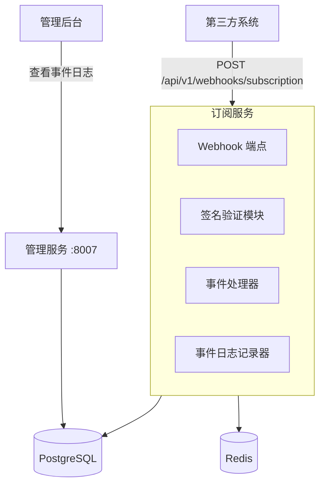
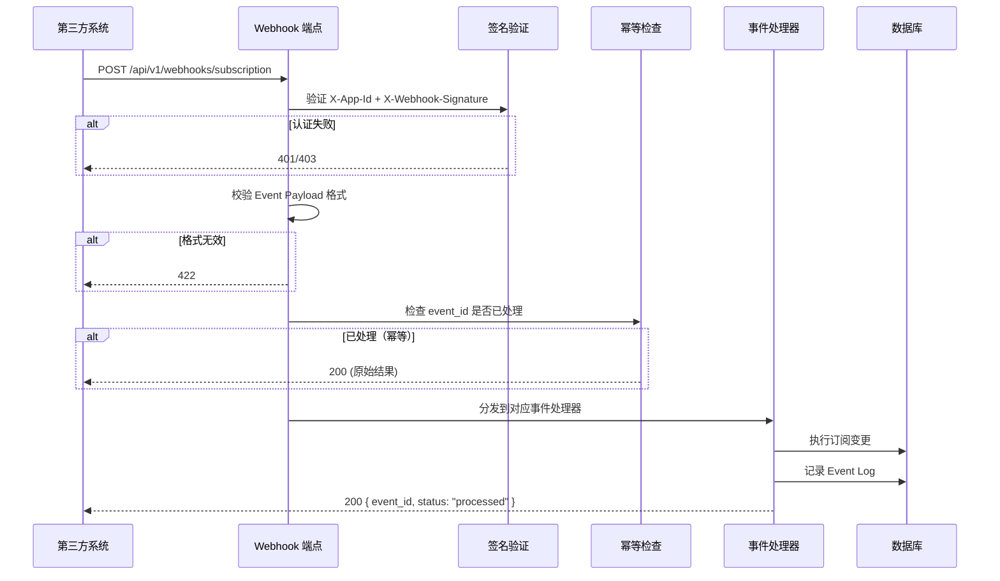

# 设计文档：Subscription Webhook

## 概述

本设计为现有订阅服务（`services/subscription/main.py`，端口 8006）增加 Webhook 接收能力，使第三方系统能通过标准化的 HTTP POST 请求推送订阅事件（创建、续费、升级、降级、取消、到期），平台自动完成对应用户的订阅状态变更。

核心设计决策：
- **复用现有凭证体系**：Webhook 认证基于 Application 的 `app_id` + `app_secret`，通过 HMAC-SHA256 签名验证请求合法性，不引入独立的 Webhook Source
- **复用 AppUser 绑定关系**：用户标识通过已有的 `AppUser` 表校验，不引入额外映射表
- **端点集成到订阅服务**：新增 `/api/v1/webhooks/subscription` POST 端点到现有订阅服务
- **幂等处理**：基于 `event_id` 的幂等机制，防止重复处理

### 认证方式说明

与网关的 `X-App-Id` + `X-App-Secret` 直接传递明文密钥不同，Webhook 采用 HMAC-SHA256 签名认证：

1. 第三方系统在请求头中携带 `X-App-Id`（标识应用）
2. 使用 `app_secret` 作为 HMAC 密钥，对请求体进行 HMAC-SHA256 签名
3. 将签名放入 `X-Webhook-Signature` 头部
4. 服务端从数据库获取 `app_secret_hash`，由于 `app_secret` 是哈希存储的，服务端无法还原明文来计算 HMAC

**关键问题与解决方案**：现有系统中 `app_secret` 以哈希形式存储（`app_secret_hash`），服务端无法还原明文来计算 HMAC。因此需要为 Application 增加一个专用的 `webhook_secret` 字段（明文或对称加密存储），在应用创建时自动生成，专门用于 Webhook 签名验证。这个 `webhook_secret` 在应用配置向导中与 `app_id`/`app_secret` 一起展示给第三方系统。

```
第三方系统                                    平台 Webhook 端点
    |                                              |
    |  POST /api/v1/webhooks/subscription          |
    |  X-App-Id: <app_id>                          |
    |  X-Webhook-Signature: sha256=<hmac_hex>      |
    |  Body: { event_id, event_type, ... }         |
    |  ─────────────────────────────────────────>   |
    |                                              |
    |              1. 查找 Application (by app_id)  |
    |              2. 检查 Application 状态          |
    |              3. 用 webhook_secret 计算 HMAC   |
    |              4. 恒定时间比较签名               |
    |              5. 校验 event payload            |
    |              6. 检查 AppUser 绑定关系          |
    |              7. 执行订阅变更                   |
    |              8. 记录 Event Log                |
    |                                              |
    |  200 OK { event_id, status: "processed" }    |
    |  <─────────────────────────────────────────   |
```

## 架构

### 系统架构

Webhook 接收功能作为订阅服务的扩展模块，不引入新的独立服务。



### 请求处理流程



## 组件与接口

### 1. Webhook 签名验证模块

**文件**：`services/subscription/webhook_auth.py`

负责 HMAC-SHA256 签名验证，复用现有的 Application 模型查询。

```python
async def verify_webhook_signature(
    app_id: str, 
    signature: str, 
    body: bytes
) -> dict:
    """
    验证 Webhook 请求签名。
    
    1. 通过 app_id 查找 Application
    2. 检查 Application 状态是否为 active
    3. 使用 webhook_secret 计算 HMAC-SHA256
    4. 恒定时间比较签名
    
    Returns: Application 配置字典
    Raises: HTTPException 401/403
    """
```

### 2. 事件处理器

**文件**：`services/subscription/webhook_handlers.py`

每种事件类型对应一个处理函数，统一接口签名。

```python
async def handle_subscription_created(app_id: str, data: dict, db: Session) -> dict
async def handle_subscription_renewed(app_id: str, data: dict, db: Session) -> dict
async def handle_subscription_upgraded(app_id: str, data: dict, db: Session) -> dict
async def handle_subscription_downgraded(app_id: str, data: dict, db: Session) -> dict
async def handle_subscription_cancelled(app_id: str, data: dict, db: Session) -> dict
async def handle_subscription_expired(app_id: str, data: dict, db: Session) -> dict
```

每个处理函数：
- 校验 `user_id` 是否属于该 Application 的 AppUser 绑定
- 校验 `plan_id` 对应的订阅计划是否存在且活跃
- 执行对应的订阅变更操作
- 返回处理结果摘要

### 3. Webhook 端点

**文件**：`services/subscription/main.py`（新增端点）

```python
@app.post("/api/v1/webhooks/subscription")
async def receive_webhook(request: Request, db: Session = Depends(get_db)):
    """接收并处理第三方订阅 Webhook 事件"""
```

### 4. 事件日志查询接口

**文件**：`services/subscription/main.py`（新增端点）

```python
@app.get("/api/v1/webhooks/events")
async def list_webhook_events(
    app_id: Optional[str] = None,
    event_type: Optional[str] = None,
    status: Optional[str] = None,
    start_time: Optional[datetime] = None,
    end_time: Optional[datetime] = None,
    page: int = 1,
    page_size: int = 20,
    db: Session = Depends(get_db)
):
    """分页查询 Webhook 事件日志"""
```

### 5. 管理后台事件日志组件

**文件**：`admin-ui/src/pages/panels/WebhookEventsPanel.tsx`

在应用详情页中新增 Tab，展示该应用的 Webhook 事件日志列表，支持状态筛选和详情查看。

## 数据模型

### WebhookEventLog 表

新增 `webhook_event_logs` 表，记录所有 Webhook 事件。

**文件**：`shared/models/webhook.py`

```python
class WebhookEventLog(Base):
    """Webhook 事件日志表"""
    __tablename__ = "webhook_event_logs"
    
    id = Column(UUID(as_uuid=True), primary_key=True, default=uuid.uuid4)
    event_id = Column(String(255), unique=True, nullable=False, index=True)  # 幂等键
    app_id = Column(String(64), nullable=False, index=True)  # 来源应用的 app_id
    event_type = Column(String(50), nullable=False, index=True)  # subscription.created 等
    status = Column(String(20), default='pending', nullable=False, index=True)  # pending/success/failed/duplicate
    request_summary = Column(JSON, nullable=True)  # 请求体摘要（脱敏后）
    response_summary = Column(JSON, nullable=True)  # 处理结果摘要
    error_message = Column(Text, nullable=True)  # 错误信息
    processed_at = Column(DateTime, nullable=True)  # 处理完成时间
    created_at = Column(DateTime, default=datetime.utcnow, nullable=False)
```

### Application 表扩展

在现有 `Application` 模型中增加 `webhook_secret` 字段：

```python
# 在 Application 模型中新增
webhook_secret = Column(String(255), nullable=True)  # Webhook 签名密钥（明文存储）
```

- 应用创建时自动生成 32 字节随机 hex 字符串作为 `webhook_secret`
- 在管理后台的应用详情页展示，供第三方系统配置
- 支持重置 `webhook_secret`

### Event Payload 标准化结构

```python
class WebhookEventPayload(BaseModel):
    """Webhook 事件标准化数据结构"""
    event_id: str           # 唯一事件标识（幂等键）
    event_type: str         # 事件类型枚举
    timestamp: str          # ISO 8601 格式时间戳
    data: EventData         # 事件数据

class EventData(BaseModel):
    """事件数据"""
    user_id: str            # 平台用户 ID
    plan_id: str            # 平台订阅计划 ID
    effective_date: str     # 生效日期 ISO 8601
    expiry_date: Optional[str] = None  # 到期日期（取消/到期事件可选）
```

### 支持的 event_type 枚举

| event_type | 说明 | 订阅变更操作 |
|---|---|---|
| `subscription.created` | 新建订阅 | 创建活跃订阅记录 |
| `subscription.renewed` | 续费 | 延长到期日期 |
| `subscription.upgraded` | 升级 | 更新订阅计划 |
| `subscription.downgraded` | 降级 | 更新订阅计划 |
| `subscription.cancelled` | 取消 | 状态设为 cancelled |
| `subscription.expired` | 到期 | 状态设为 expired |


## 正确性属性（Correctness Properties）

*正确性属性是在系统所有合法执行路径中都应成立的特征或行为——本质上是对系统应做什么的形式化陈述。属性是人类可读规格说明与机器可验证正确性保证之间的桥梁。*

### Property 1: HMAC 签名验证往返一致性

*对于任意* 合法的 webhook_secret 和任意请求体字节序列，使用该 secret 计算 HMAC-SHA256 签名后，验证函数应返回通过。

**Validates: Requirements 1.1**

### Property 2: 缺少认证头部返回 401

*对于任意* Webhook 请求，若缺少 `X-App-Id` 或 `X-Webhook-Signature` 头部中的任意一个，系统应返回 HTTP 401 状态码。

**Validates: Requirements 1.2, 1.3**

### Property 3: 无效或禁用应用返回 403

*对于任意* `app_id`，若该 app_id 对应的 Application 不存在或状态为 disabled，系统应返回 HTTP 403 状态码。

**Validates: Requirements 1.4**

### Property 4: 错误签名返回 401 并记录日志

*对于任意* 合法的 app_id 和任意错误的签名值，系统应返回 HTTP 401 状态码，且 Event_Log 中应存在一条对应的验证失败记录。

**Validates: Requirements 1.5**

### Property 5: 无效 Payload 返回 422

*对于任意* 不符合标准化格式的 Event_Payload（缺少必填字段、event_type 不在枚举范围内、data 字段缺少必要信息），系统应返回 HTTP 422 状态码和具体的字段校验错误信息。

**Validates: Requirements 2.1, 2.2, 2.3, 2.4**

### Property 6: 创建订阅事件生成活跃订阅

*对于任意* 合法的 `subscription.created` 事件（用户属于该应用、计划存在且活跃），处理后该用户应存在一条状态为 `active` 的订阅记录，且 plan_id、start_date、end_date 与事件数据一致。

**Validates: Requirements 3.1**

### Property 7: 续费事件延长到期日期

*对于任意* 合法的 `subscription.renewed` 事件，处理后该用户订阅的 `end_date` 应更新为事件数据中的 `expiry_date`。

**Validates: Requirements 3.2**

### Property 8: 升级/降级事件更新订阅计划

*对于任意* 合法的 `subscription.upgraded` 或 `subscription.downgraded` 事件，处理后该用户订阅的 `plan_id` 应更新为事件数据中的目标 `plan_id`。

**Validates: Requirements 3.3**

### Property 9: 取消/到期事件设置终态状态

*对于任意* 合法的 `subscription.cancelled` 事件，处理后订阅状态应为 `cancelled`；*对于任意* 合法的 `subscription.expired` 事件，处理后订阅状态应为 `expired`。

**Validates: Requirements 3.4, 3.5**

### Property 10: 无效用户或计划引用返回 422

*对于任意* 事件，若 `user_id` 不属于该 Application 的 AppUser 绑定关系，或 `plan_id` 对应的订阅计划不存在或已停用，系统应返回 HTTP 422 状态码并在 Event_Log 中记录错误。

**Validates: Requirements 3.6, 3.7**

### Property 11: 幂等性——重复事件不改变状态

*对于任意* 已成功处理的事件，使用相同的 `event_id` 再次提交时，系统应返回 HTTP 200 和原始处理结果，且数据库中的订阅状态不发生任何变化。

**Validates: Requirements 4.2**

### Property 12: 每个请求生成完整事件日志

*对于任意* Webhook 请求（无论成功或失败），系统应创建一条 Event_Log 记录，包含事件ID、应用ID、事件类型、处理状态、请求体摘要和处理时间戳。

**Validates: Requirements 5.1, 5.2**

### Property 13: 事件日志筛选查询正确性

*对于任意* 事件日志集合和任意筛选条件组合（应用、事件类型、处理状态、时间范围），查询返回的所有记录应满足所有指定的筛选条件，且不遗漏任何满足条件的记录。

**Validates: Requirements 5.3**

### Property 14: 成功响应格式一致性

*对于任意* 成功处理的事件，响应体应为 JSON 格式，包含 `event_id`（与请求中的 event_id 一致）和 `status` 字段值为 `"processed"`。

**Validates: Requirements 6.2**

## 错误处理

### HTTP 状态码映射

| 场景 | 状态码 | 错误信息 |
|---|---|---|
| 缺少 X-App-Id 或 X-Webhook-Signature | 401 | 缺少认证头部 |
| 签名验证失败 | 401 | 签名验证失败 |
| Application 不存在或已禁用 | 403 | 应用不存在或已禁用 |
| Payload 格式无效 | 422 | 具体字段校验错误 |
| user_id 不属于该应用 | 422 | 用户不属于该应用 |
| plan_id 无效或已停用 | 422 | 订阅计划无效 |
| 内部处理错误 | 500 | 内部服务器错误 |

### 错误响应格式

```json
{
  "error_code": "invalid_signature",
  "message": "签名验证失败",
  "details": {}
}
```

### 异常处理策略

1. **签名验证失败**：记录 Event_Log（status=failed），返回 401，不暴露具体原因
2. **Payload 校验失败**：记录 Event_Log（status=failed），返回 422 + 具体字段错误
3. **业务逻辑错误**（用户/计划无效）：记录 Event_Log（status=failed），返回 422
4. **内部异常**：记录 Event_Log（status=failed），返回 500，日志记录完整堆栈
5. **幂等命中**：记录 Event_Log（status=duplicate），返回 200 + 原始结果

## 测试策略

### 属性测试（Property-Based Testing）

使用 `hypothesis` 库进行属性测试，每个属性测试至少运行 100 次迭代。

每个测试用 comment 标注对应的设计属性：
```python
# Feature: subscription-webhook, Property 1: HMAC 签名验证往返一致性
```

属性测试覆盖：
- Property 1: 生成随机 secret 和 body，验证 HMAC 签名往返
- Property 2: 生成随机请求，随机移除头部，验证 401
- Property 3: 生成随机 app_id（不存在/disabled），验证 403
- Property 4: 生成合法 app_id + 随机错误签名，验证 401 + 日志
- Property 5: 生成随机不完整/无效 payload，验证 422
- Property 6-9: 生成随机合法事件，验证对应订阅变更
- Property 10: 生成随机无效 user_id/plan_id，验证 422
- Property 11: 生成随机事件，处理两次，验证幂等性
- Property 12: 生成随机请求，验证日志完整性
- Property 13: 生成随机日志集合 + 随机筛选条件，验证查询正确性
- Property 14: 生成随机合法事件，验证响应格式

### 单元测试

单元测试聚焦于具体示例和边界情况：

- 各事件类型的具体处理流程（使用固定测试数据）
- 签名计算的具体示例验证
- Payload 校验的边界情况（空字符串、超长字段、特殊字符）
- 幂等处理的具体场景
- 事件日志查询的分页边界
- 内部异常时的错误日志记录
- 并发请求的幂等处理

### 测试文件组织

```
tests/
  test_webhook_auth.py          # 签名验证单元测试
  test_webhook_handlers.py      # 事件处理器单元测试
  test_webhook_endpoint.py      # 端点集成测试
  test_webhook_properties.py    # 属性测试（所有 Property）
  test_webhook_events_query.py  # 事件日志查询测试
```
