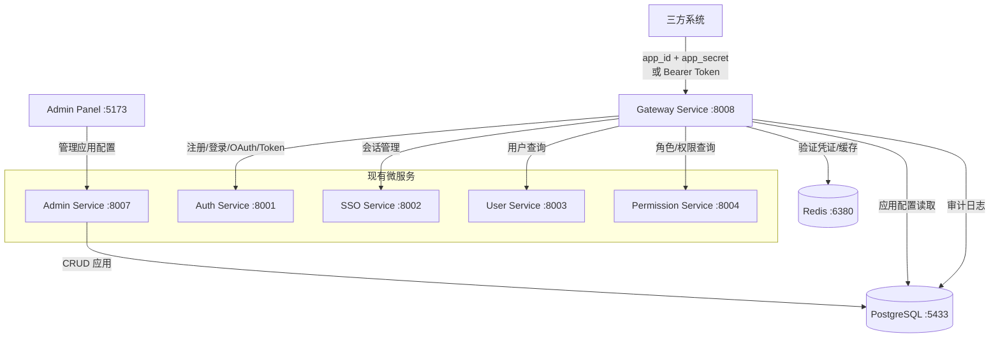
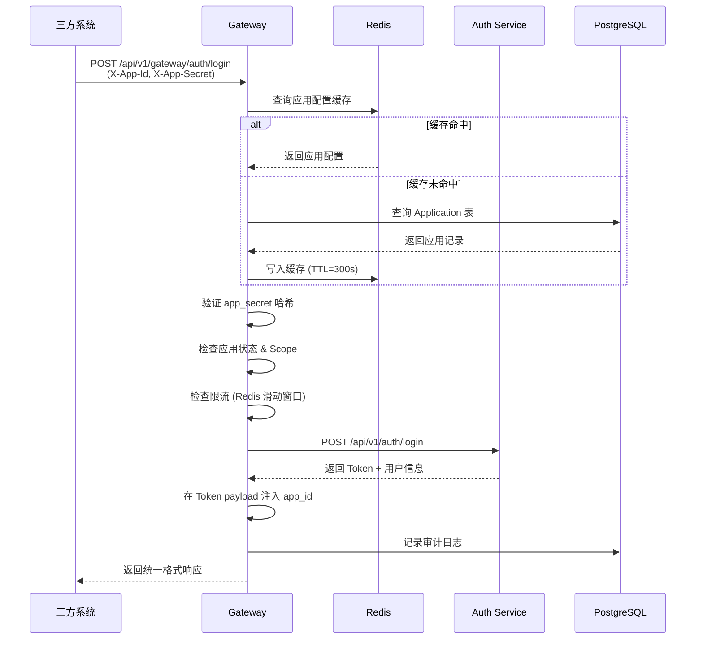

# 设计文档：统一 API 网关

## 概述

统一 API 网关（Gateway Service）是一个独立的 FastAPI 微服务（端口 8008），作为三方系统对接平台的唯一入口。网关本身不实现业务逻辑，而是通过内部 HTTP 调用将请求路由到现有微服务（Auth Service、User Service、Permission Service 等），同时负责应用凭证验证、请求限流、权限范围检查和审计日志记录。

管理员通过现有 Admin Panel（admin-ui）管理应用配置，包括创建应用、配置登录方式、设置权限范围和限流阈值。三方系统使用 `app_id` + `app_secret` 凭证对接网关 API，完成用户注册、登录、鉴权和用户管理。

### 关键设计决策

1. **网关作为独立服务**：新增 `services/gateway/main.py`，遵循现有微服务架构模式，端口 8008
2. **内部 HTTP 路由**：网关通过 `httpx.AsyncClient` 调用下游微服务，不直接操作数据库（应用管理除外）
3. **复用现有模块**：JWT 解析用 `shared/utils/jwt`，密码哈希用 `shared/utils/crypto`，审计日志用 `shared/utils/audit_log`，健康检查用 `shared/utils/health_check`
4. **Redis 缓存**：应用配置、Scope 和限流计数器均缓存在 Redis 中，配置变更后 5 秒内失效
5. **新增数据模型**：在 `shared/models/` 下新增 `application.py`，包含 Application、AppLoginMethod、AppScope、AppUser 四张表

## 架构

### 系统架构图



### 请求处理流程



## 组件与接口

### 1. Gateway Service (`services/gateway/main.py`)

网关主服务，FastAPI 应用，端口 8008。

**对外 API 端点：**

| 路径 | 方法 | 鉴权方式 | 说明 | 路由目标 |
|------|------|----------|------|----------|
| `/api/v1/gateway/auth/register/email` | POST | App Credential | 邮箱注册 | Auth :8001 |
| `/api/v1/gateway/auth/register/phone` | POST | App Credential | 手机注册 | Auth :8001 |
| `/api/v1/gateway/auth/login` | POST | App Credential | 登录 | Auth :8001 |
| `/api/v1/gateway/auth/oauth/{provider}` | POST | App Credential | OAuth 登录 | Auth :8001 |
| `/api/v1/gateway/auth/refresh` | POST | App Credential | 刷新 Token | Auth :8001 |
| `/api/v1/gateway/users/{user_id}` | GET | Bearer Token | 查询用户信息 | User :8003 |
| `/api/v1/gateway/users/{user_id}/roles` | GET | Bearer Token | 查询用户角色 | Perm :8004 |
| `/api/v1/gateway/users/{user_id}/permissions/check` | POST | Bearer Token | 检查权限 | Perm :8004 |
| `/api/v1/gateway/auth/change-password` | POST | Bearer Token | 修改密码 | Auth :8001 |
| `/health` | GET | 无 | 健康检查 | 本地 |
| `/api/v1/gateway/info` | GET | 无 | 网关信息 | 本地 |

### 2. 应用凭证验证中间件 (`AppCredentialMiddleware`)

从请求头 `X-App-Id` 和 `X-App-Secret` 提取凭证，验证应用身份。

```python
# 伪代码
async def verify_app_credential(app_id: str, app_secret: str) -> Application:
    app = await get_app_from_cache_or_db(app_id)
    if not app or app.status != 'active':
        raise HTTPException(401, "凭证无效")
    if not verify_password(app_secret, app.app_secret_hash):
        raise HTTPException(401, "凭证无效")
    return app
```

关键行为：
- 凭证验证失败统一返回 401 "凭证无效"，不区分 app_id 不存在或 app_secret 错误
- 应用被禁用返回 403
- 验证通过后将 Application 对象注入请求上下文

### 3. Scope 权限检查 (`ScopeChecker`)

每个 API 端点映射到一个 Scope，请求时检查应用是否拥有该 Scope。

```python
# API 端点到 Scope 的映射
ENDPOINT_SCOPE_MAP = {
    "auth/register/*": "auth:register",
    "auth/login": "auth:login",
    "auth/oauth/*": "auth:login",
    "auth/refresh": "auth:login",
    "auth/change-password": "user:write",
    "users/*/roles": "role:read",
    "users/*/permissions/check": "role:read",
    "users/*": "user:read",
}
```

### 4. 限流器 (`RateLimiter`)

基于 Redis 滑动窗口算法，按 `app_id` 维度限流。

```python
async def check_rate_limit(app_id: str, limit: int) -> RateLimitResult:
    """
    使用 Redis ZSET 实现滑动窗口限流。
    key: rate_limit:{app_id}
    score: 请求时间戳（毫秒）
    member: 唯一请求 ID
    窗口: 60 秒
    """
```

响应头：
- `X-RateLimit-Limit`: 每分钟允许的最大请求数
- `X-RateLimit-Remaining`: 当前窗口剩余请求数
- `X-RateLimit-Reset`: 窗口重置的 Unix 时间戳

### 5. 内部服务路由器 (`ServiceRouter`)

封装对下游微服务的 HTTP 调用，统一错误处理。

```python
class ServiceRouter:
    def __init__(self):
        self.services = {
            "auth": "http://localhost:8001",
            "sso": "http://localhost:8002",
            "user": "http://localhost:8003",
            "permission": "http://localhost:8004",
        }
        self.client = httpx.AsyncClient(timeout=10.0)
    
    async def forward(self, service: str, method: str, path: str, **kwargs) -> dict:
        """转发请求到下游服务，统一错误处理"""
```

### 6. 统一错误处理 (`ErrorHandler`)

所有错误响应遵循统一 JSON 格式：

```json
{
    "error_code": "invalid_credentials",
    "message": "凭证无效",
    "request_id": "550e8400-e29b-41d4-a716-446655440000"
}
```

每个请求生成唯一 `request_id`（UUID），通过 `X-Request-Id` 响应头返回。

### 7. Admin Panel 应用管理页面

在现有 admin-ui 中新增应用管理模块：

- **应用列表页** (`ApplicationsPanel.tsx`)：展示所有应用的名称、app_id、状态、创建时间，支持创建/禁用/删除
- **应用详情页** (`ApplicationDetail.tsx`)：配置登录方式、OAuth 凭证、Scope 权限、限流阈值
- **应用管理 API**：在 Admin Service 中新增应用 CRUD 端点


## 数据模型

### 新增模型：`shared/models/application.py`

#### Application（应用表）

| 字段 | 类型 | 约束 | 说明 |
|------|------|------|------|
| id | UUID | PK, default uuid4 | 主键 |
| name | String(255) | NOT NULL | 应用名称 |
| description | Text | nullable | 应用描述 |
| app_id | String(64) | UNIQUE, NOT NULL, INDEX | 应用 ID（UUID 格式） |
| app_secret_hash | String(255) | NOT NULL | app_secret 的哈希值（使用 shared/utils/crypto.hash_password） |
| status | String(20) | NOT NULL, default 'active', INDEX | 状态：active / disabled |
| rate_limit | Integer | NOT NULL, default 60 | 每分钟请求限制 |
| created_at | DateTime | NOT NULL | 创建时间 |
| updated_at | DateTime | NOT NULL | 更新时间 |

#### AppLoginMethod（应用登录方式表）

| 字段 | 类型 | 约束 | 说明 |
|------|------|------|------|
| id | UUID | PK | 主键 |
| application_id | UUID | FK -> applications.id, NOT NULL, INDEX | 所属应用 |
| method | String(20) | NOT NULL | 登录方式：email / phone / wechat / alipay / google / apple |
| is_enabled | Boolean | NOT NULL, default True | 是否启用 |
| oauth_config | Text | nullable | 加密存储的 OAuth 配置（client_id, client_secret），使用 shared/utils/crypto.encrypt_config |
| created_at | DateTime | NOT NULL | 创建时间 |
| updated_at | DateTime | NOT NULL | 更新时间 |

唯一约束：`(application_id, method)` 联合唯一

#### AppScope（应用权限范围表）

| 字段 | 类型 | 约束 | 说明 |
|------|------|------|------|
| id | UUID | PK | 主键 |
| application_id | UUID | FK -> applications.id, NOT NULL, INDEX | 所属应用 |
| scope | String(50) | NOT NULL | 权限范围：user:read / user:write / auth:login / auth:register / role:read / role:write / org:read / org:write |
| created_at | DateTime | NOT NULL | 创建时间 |

唯一约束：`(application_id, scope)` 联合唯一

#### AppUser（应用用户绑定表）

| 字段 | 类型 | 约束 | 说明 |
|------|------|------|------|
| id | UUID | PK | 主键 |
| application_id | UUID | FK -> applications.id, NOT NULL, INDEX | 所属应用 |
| user_id | UUID | FK -> users.id, NOT NULL, INDEX | 用户 ID |
| created_at | DateTime | NOT NULL | 绑定时间 |

唯一约束：`(application_id, user_id)` 联合唯一

### SQLAlchemy 模型定义

```python
# shared/models/application.py
class Application(Base):
    __tablename__ = "applications"
    
    id = Column(UUID(as_uuid=True), primary_key=True, default=uuid.uuid4)
    name = Column(String(255), nullable=False)
    description = Column(Text, nullable=True)
    app_id = Column(String(64), unique=True, nullable=False, index=True)
    app_secret_hash = Column(String(255), nullable=False)
    status = Column(String(20), default='active', nullable=False, index=True)
    rate_limit = Column(Integer, default=60, nullable=False)
    created_at = Column(DateTime, default=datetime.utcnow, nullable=False)
    updated_at = Column(DateTime, default=datetime.utcnow, onupdate=datetime.utcnow, nullable=False)
    
    login_methods = relationship("AppLoginMethod", back_populates="application", cascade="all, delete-orphan")
    scopes = relationship("AppScope", back_populates="application", cascade="all, delete-orphan")
    app_users = relationship("AppUser", back_populates="application", cascade="all, delete-orphan")

class AppLoginMethod(Base):
    __tablename__ = "app_login_methods"
    
    id = Column(UUID(as_uuid=True), primary_key=True, default=uuid.uuid4)
    application_id = Column(UUID(as_uuid=True), ForeignKey('applications.id', ondelete='CASCADE'), nullable=False, index=True)
    method = Column(String(20), nullable=False)
    is_enabled = Column(Boolean, default=True, nullable=False)
    oauth_config = Column(Text, nullable=True)  # 加密存储
    created_at = Column(DateTime, default=datetime.utcnow, nullable=False)
    updated_at = Column(DateTime, default=datetime.utcnow, onupdate=datetime.utcnow, nullable=False)
    
    application = relationship("Application", back_populates="login_methods")
    __table_args__ = (UniqueConstraint('application_id', 'method', name='uq_app_login_method'),)

class AppScope(Base):
    __tablename__ = "app_scopes"
    
    id = Column(UUID(as_uuid=True), primary_key=True, default=uuid.uuid4)
    application_id = Column(UUID(as_uuid=True), ForeignKey('applications.id', ondelete='CASCADE'), nullable=False, index=True)
    scope = Column(String(50), nullable=False)
    created_at = Column(DateTime, default=datetime.utcnow, nullable=False)
    
    application = relationship("Application", back_populates="scopes")
    __table_args__ = (UniqueConstraint('application_id', 'scope', name='uq_app_scope'),)

class AppUser(Base):
    __tablename__ = "app_users"
    
    id = Column(UUID(as_uuid=True), primary_key=True, default=uuid.uuid4)
    application_id = Column(UUID(as_uuid=True), ForeignKey('applications.id', ondelete='CASCADE'), nullable=False, index=True)
    user_id = Column(UUID(as_uuid=True), ForeignKey('users.id', ondelete='CASCADE'), nullable=False, index=True)
    created_at = Column(DateTime, default=datetime.utcnow, nullable=False)
    
    application = relationship("Application", back_populates="app_users")
    user = relationship("User")
    __table_args__ = (UniqueConstraint('application_id', 'user_id', name='uq_app_user'),)
```

### Redis 缓存结构

| Key 模式 | 类型 | TTL | 说明 |
|----------|------|-----|------|
| `app:{app_id}` | Hash | 300s | 应用基本信息（name, status, rate_limit, app_secret_hash） |
| `app:{app_id}:methods` | Set | 300s | 已启用的登录方式集合 |
| `app:{app_id}:scopes` | Set | 300s | 已授权的 Scope 集合 |
| `app:{app_id}:oauth:{provider}` | Hash | 300s | 加密的 OAuth 配置 |
| `rate_limit:{app_id}` | ZSet | 自动清理 | 滑动窗口限流计数器（score=时间戳, member=请求ID） |

配置变更时，通过删除对应 Redis key 使缓存失效，下次请求时自动从数据库重新加载。

### Alembic 迁移

新增迁移文件 `alembic/versions/XXX_add_application_tables.py`，创建 `applications`、`app_login_methods`、`app_scopes`、`app_users` 四张表。


## 正确性属性（Correctness Properties）

*属性（Property）是指在系统所有合法执行路径中都应成立的特征或行为——本质上是对系统应做什么的形式化陈述。属性是人类可读规格说明与机器可验证正确性保证之间的桥梁。*

### Property 1: 应用凭证创建与哈希验证往返

*For any* 合法的应用名称和描述，创建应用后生成的 app_id 应为合法 UUID 格式，app_secret 长度至少 32 字节，且使用 `crypto.verify_password(原始app_secret, 存储的hash)` 应返回 True。

**Validates: Requirements 1.1, 1.2**

### Property 2: 重置凭证使旧凭证失效

*For any* 已存在的 Application，重置 app_secret 后，使用旧 app_secret 调用 `verify_password` 应返回 False，使用新 app_secret 应返回 True。

**Validates: Requirements 1.3**

### Property 3: 禁用应用拒绝所有请求

*For any* 状态为 disabled 的 Application 和任意 API 请求，网关应返回 HTTP 403 状态码。

**Validates: Requirements 1.4**

### Property 4: 删除应用清除 Redis 缓存

*For any* Application，删除该应用后，Redis 中所有以 `app:{app_id}` 为前缀的 key 应不存在。

**Validates: Requirements 1.6**

### Property 5: OAuth 登录方式启用需要完整配置

*For any* OAuth 类型的 Login_Method（wechat、alipay、google、apple），启用时若未提供 client_id 或 client_secret，操作应被拒绝。

**Validates: Requirements 2.2**

### Property 6: 禁用的登录方式拒绝请求

*For any* Application 和任意处于禁用状态的 Login_Method，通过该方式发起的注册或登录请求应返回 HTTP 400 状态码，且错误响应中包含该应用当前已启用的登录方式列表。

**Validates: Requirements 2.3, 3.7**

### Property 7: 配置变更使缓存失效

*For any* Application 配置变更（包括登录方式、Scope、限流阈值），变更后对应的 Redis 缓存 key 应被删除。

**Validates: Requirements 2.4, 5.3**

### Property 8: OAuth client_secret 加密存储往返

*For any* OAuth 配置中的 client_secret，使用 `crypto.encrypt_config` 加密后再用 `crypto.decrypt_config` 解密应得到原始值，且 API 返回时仅展示末尾 4 位字符。

**Validates: Requirements 2.5**

### Property 9: 网关路由认证请求到正确的下游服务

*For any* 拥有合法凭证且已启用对应 Login_Method 的 Application，通过网关发起的注册/登录请求应被正确路由到 Auth_Service 对应端点，并返回预期的用户 ID 或 Token。

**Validates: Requirements 3.1, 3.2, 3.3, 3.5**

### Property 10: OAuth 登录使用应用级配置

*For any* 配置了 OAuth 凭证的 Application，通过网关发起的 OAuth 登录请求应使用该应用自身的 client_id 和 client_secret，而非全局 OAuth 配置。

**Validates: Requirements 3.4**

### Property 11: 凭证验证失败返回统一错误

*For any* 无效的凭证组合（app_id 不存在、app_secret 错误、或两者都错），网关应返回相同的 HTTP 401 响应体 `{"error_code": "...", "message": "凭证无效", ...}`，不泄露具体失败原因。

**Validates: Requirements 3.6**

### Property 12: 注册成功创建应用用户绑定

*For any* 通过网关成功注册的用户，AppUser 表中应存在一条记录将该用户与注册时使用的 Application 关联。

**Validates: Requirements 3.8**

### Property 13: Token 包含 app_id 且跨应用不可用

*For any* 通过网关签发的 access_token，其 payload 中应包含 `app_id` 字段，且使用该 Token 访问其他 Application 的 API 时应被拒绝。

**Validates: Requirements 4.3, 4.6**

### Property 14: 缺少 Scope 的请求被拒绝

*For any* Application 和任意未授权的 Scope，访问需要该 Scope 的 API 端点应返回 HTTP 403 和 error_code 为 `insufficient_scope`。

**Validates: Requirements 5.2, 5.4**

### Property 15: 滑动窗口限流

*For any* Application 及其配置的限流阈值 N，在 60 秒窗口内发送超过 N 次请求后，后续请求应返回 HTTP 429 状态码，且响应头包含 `Retry-After` 字段。

**Validates: Requirements 6.1, 6.3**

### Property 16: 所有响应包含限流头

*For any* 网关 API 响应，响应头中应包含 `X-RateLimit-Limit`、`X-RateLimit-Remaining` 和 `X-RateLimit-Reset` 三个字段，且 Remaining <= Limit。

**Validates: Requirements 6.4**

### Property 17: 审计日志记录完整

*For any* 通过网关的 API 请求，审计日志中应存在对应记录，包含 app_id、请求路径、HTTP 方法、响应状态码和响应时间。

**Validates: Requirements 6.5**

### Property 18: 非绑定用户访问被拒绝

*For any* 不属于请求 Application 的 AppUser 的用户，通过该应用访问用户级 API 应返回 HTTP 403 和 error_code 为 `user_not_bound`。

**Validates: Requirements 7.5**

### Property 19: 下游服务不可用返回 503

*For any* 不可用的下游微服务，网关对该服务相关的 API 请求应返回 HTTP 503 状态码。

**Validates: Requirements 8.2**

### Property 20: 统一错误响应格式

*For any* 网关返回的错误响应，JSON 体应包含且仅包含 `error_code`（字符串）、`message`（字符串）和 `request_id`（合法 UUID 格式）三个字段，且不包含内部微服务的实现细节。

**Validates: Requirements 9.1, 9.2**

### Property 21: 每个请求有唯一 request_id

*For any* 网关 API 请求，响应头 `X-Request-Id` 应包含一个合法 UUID，且不同请求的 request_id 互不相同。

**Validates: Requirements 9.3**

## 错误处理

### 错误码定义

| error_code | HTTP 状态码 | 说明 |
|------------|------------|------|
| `invalid_credentials` | 401 | app_id 或 app_secret 无效 |
| `app_disabled` | 403 | 应用已被禁用 |
| `token_expired` | 401 | access_token 已过期 |
| `invalid_token` | 401 | access_token 格式无效或签名验证失败 |
| `login_method_disabled` | 400 | 请求的登录方式未启用 |
| `insufficient_scope` | 403 | 应用未被授予所需的权限范围 |
| `user_not_bound` | 403 | 用户不属于该应用 |
| `rate_limit_exceeded` | 429 | 请求频率超过限制 |
| `service_unavailable` | 503 | 下游微服务不可用 |
| `upstream_error` | 502 | 下游微服务返回非预期错误 |
| `validation_error` | 422 | 请求参数验证失败 |
| `internal_error` | 500 | 网关内部错误 |

### 错误处理策略

1. **凭证错误**：统一返回 `invalid_credentials`，不区分 app_id 不存在或 app_secret 错误，防止枚举攻击
2. **下游服务错误**：捕获所有下游服务异常，转换为统一格式，隐藏内部实现细节
3. **超时处理**：下游服务调用超时（10 秒）返回 `service_unavailable`
4. **审计日志**：所有错误响应均记录审计日志，包含 error_code 和请求上下文

## 测试策略

### 属性测试（Property-Based Testing）

- 使用 **Hypothesis** 库（Python 生态中最成熟的属性测试框架）
- 每个属性测试至少运行 **100 次迭代**
- 每个测试用注释标注对应的设计属性：`# Feature: unified-api-gateway, Property {N}: {描述}`
- 每个正确性属性对应一个属性测试函数

**属性测试覆盖范围：**
- Property 1: 凭证创建与哈希验证往返
- Property 2: 重置凭证使旧凭证失效
- Property 3: 禁用应用拒绝请求
- Property 6: 禁用登录方式拒绝请求
- Property 7: 配置变更使缓存失效
- Property 8: OAuth client_secret 加密往返
- Property 11: 凭证验证失败返回统一错误
- Property 13: Token 包含 app_id
- Property 14: 缺少 Scope 拒绝请求
- Property 15: 滑动窗口限流
- Property 16: 响应包含限流头
- Property 20: 统一错误响应格式
- Property 21: 唯一 request_id

### 单元测试

单元测试聚焦于具体示例、边界情况和集成点：

- **边界情况**：过期 Token（4.4）、无效 Token（4.5）、下游非预期错误格式（9.4）
- **具体示例**：健康检查端点返回所有下游服务状态（8.1）、网关信息端点（8.4）、降级启动（8.3）、应用列表 API 返回必要字段（1.5）
- **集成测试**：网关到 Auth Service 的完整注册/登录流程、网关到 User/Permission Service 的用户管理流程

### 测试文件结构

```
tests/
├── test_gateway_credential_properties.py    # Property 1, 2, 11
├── test_gateway_access_control_properties.py # Property 3, 6, 14, 18
├── test_gateway_cache_properties.py          # Property 4, 7
├── test_gateway_crypto_properties.py         # Property 8
├── test_gateway_routing_properties.py        # Property 9, 10, 12, 13
├── test_gateway_ratelimit_properties.py      # Property 15, 16
├── test_gateway_response_properties.py       # Property 17, 20, 21
├── test_gateway_health.py                    # 8.1, 8.2, 8.3, 8.4 (单元测试)
├── test_gateway_edge_cases.py                # 4.4, 4.5, 9.4 (边界情况)
└── test_gateway_integration.py               # 端到端集成测试
```
