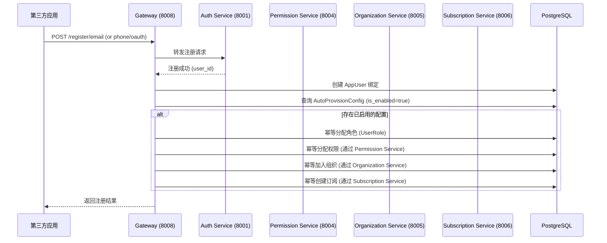
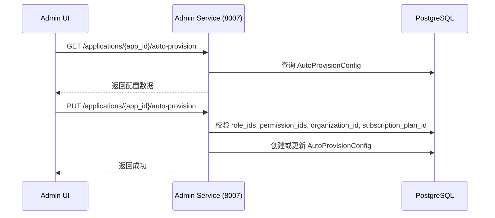

# 技术设计文档：用户自动配置（User Auto-Provisioning）

## 概述

本功能为统一认证平台新增"用户自动配置"能力。当第三方应用通过 API 网关注册用户时，系统根据该应用预先配置的自动配置规则（Auto-Provision Config），自动为新用户分配角色、权限、组织归属和订阅计划。

核心设计目标：
- 每个应用独立维护一套自动配置规则，与 Application 保持一对一关系
- 管理员通过 Admin Service API 和 Admin UI 管理配置规则
- Gateway 在用户注册成功后自动执行配置规则，失败不影响注册本身
- 所有自动分配操作保持幂等性

## 架构

### 系统交互流程



### 管理配置流程




## 组件与接口

### 1. 数据模型层 — `AutoProvisionConfig`

新增 SQLAlchemy 模型 `AutoProvisionConfig`，位于 `shared/models/application.py`。

### 2. Admin Service API — 自动配置规则管理

在 `services/admin/main.py` 中新增三个端点：

| 方法 | 路径 | 说明 |
|------|------|------|
| GET | `/api/v1/admin/applications/{app_id}/auto-provision` | 获取配置 |
| PUT | `/api/v1/admin/applications/{app_id}/auto-provision` | 创建/更新配置 |
| DELETE | `/api/v1/admin/applications/{app_id}/auto-provision` | 删除配置 |

所有端点需要超级管理员权限（复用现有 `require_super_admin` 依赖）。

#### Pydantic 模型

```python
class AutoProvisionConfigUpdate(BaseModel):
    role_ids: Optional[List[str]] = None
    permission_ids: Optional[List[str]] = None
    organization_id: Optional[str] = None
    subscription_plan_id: Optional[str] = None
    is_enabled: bool = True

class AutoProvisionConfigResponse(BaseModel):
    application_id: str
    role_ids: List[str]
    permission_ids: List[str]
    organization_id: Optional[str]
    subscription_plan_id: Optional[str]
    is_enabled: bool
    created_at: str
    updated_at: str
```

#### 校验逻辑

PUT 端点在保存前需校验所有引用 ID 的有效性：
- `role_ids`：查询 `roles` 表，确认所有 ID 存在
- `permission_ids`：查询 `permissions` 表，确认所有 ID 存在
- `organization_id`：查询 `organizations` 表，确认 ID 存在
- `subscription_plan_id`：查询 `subscription_plans` 表，确认 ID 存在

任一校验失败返回 HTTP 400，响应体包含具体的无效 ID 信息。

### 3. Gateway — 自动配置执行器

在 `services/gateway/main.py` 中新增 `_apply_auto_provision(app_data: dict, user_id: str)` 函数。

该函数在以下三个注册端点中，`_create_app_user_binding` 调用之后执行：
- `gateway_register_email`
- `gateway_register_phone`
- `gateway_oauth`（仅当 `is_new_user=True` 时）

#### 执行逻辑

```python
def _apply_auto_provision(app_data: dict, user_id: str) -> None:
    """
    根据应用的自动配置规则，为新注册用户分配角色、权限、组织和订阅。
    每一步独立执行，单步失败记录日志但不影响其余步骤。
    所有操作幂等。
    """
```

执行步骤：
1. 查询 `AutoProvisionConfig`，若不存在或 `is_enabled=False` 则直接返回
2. 角色分配：遍历 `role_ids`，对每个角色检查 `UserRole` 是否已存在，不存在则创建
3. 权限分配：遍历 `permission_ids`，通过直接操作数据库（复用 Permission Service 的模型），检查并创建 `RolePermission` 或直接用 `user_permissions` 关联（根据现有架构，权限通过角色间接分配，此处直接为用户创建 `UserRole` 关联到包含对应权限的角色，或直接在 `user_roles` 表操作）
4. 组织加入：检查 `UserOrganization` 是否已存在，不存在则创建
5. 订阅创建：检查用户是否已有该计划的 active 订阅，不存在则创建 `UserSubscription`

> 设计决策：Gateway 直接操作数据库而非通过 HTTP 调用各微服务，原因是：
> 1. 现有 `_create_app_user_binding` 已采用直接数据库操作模式
> 2. 避免注册流程中的多次 HTTP 往返延迟
> 3. 所有服务共享同一数据库和 SQLAlchemy 模型

### 4. Admin UI — 自动配置卡片

在 `ApplicationDetail.tsx` 中，在"订阅计划配置"卡片之后、"危险操作"卡片之前，新增"用户自动配置"卡片。

#### 卡片组件结构

- 总开关（Switch）：启用/禁用自动配置
- 角色多选（Select mode="multiple"）：从系统角色列表中选择
- 权限多选（Select mode="multiple"）：从系统权限列表中选择
- 组织选择（TreeSelect）：树形结构选择单个组织
- 订阅计划单选（Radio.Group）：选择一个订阅计划
- 保存按钮：调用 PUT API 保存配置

#### 前端 API 扩展

在 `admin-ui/src/api/services.ts` 的 `applicationApi` 中新增：

```typescript
// 自动配置
getAutoProvision: (appId: string, userId: string) =>
  axios.get(`${ADMIN_API}/admin/applications/${appId}/auto-provision`, { params: { user_id: userId } }),
updateAutoProvision: (appId: string, data: { ... }, userId: string) =>
  axios.put(`${ADMIN_API}/admin/applications/${appId}/auto-provision`, data, { params: { user_id: userId } }),
deleteAutoProvision: (appId: string, userId: string) =>
  axios.delete(`${ADMIN_API}/admin/applications/${appId}/auto-provision`, { params: { user_id: userId } }),
```

## 数据模型

### AutoProvisionConfig 表

```sql
CREATE TABLE auto_provision_configs (
    id UUID PRIMARY KEY DEFAULT gen_random_uuid(),
    application_id UUID NOT NULL UNIQUE REFERENCES applications(id) ON DELETE CASCADE,
    role_ids JSONB DEFAULT '[]',
    permission_ids JSONB DEFAULT '[]',
    organization_id UUID REFERENCES organizations(id) ON DELETE SET NULL,
    subscription_plan_id UUID REFERENCES subscription_plans(id) ON DELETE SET NULL,
    is_enabled BOOLEAN NOT NULL DEFAULT true,
    created_at TIMESTAMP NOT NULL DEFAULT now(),
    updated_at TIMESTAMP NOT NULL DEFAULT now()
);
```

### SQLAlchemy 模型

```python
class AutoProvisionConfig(Base):
    """应用用户自动配置规则表"""
    __tablename__ = "auto_provision_configs"

    id = Column(UUID(as_uuid=True), primary_key=True, default=uuid.uuid4)
    application_id = Column(
        UUID(as_uuid=True),
        ForeignKey('applications.id', ondelete='CASCADE'),
        nullable=False, unique=True, index=True
    )
    role_ids = Column(JSONBCompat, default=list)
    permission_ids = Column(JSONBCompat, default=list)
    organization_id = Column(
        UUID(as_uuid=True),
        ForeignKey('organizations.id', ondelete='SET NULL'),
        nullable=True
    )
    subscription_plan_id = Column(
        UUID(as_uuid=True),
        ForeignKey('subscription_plans.id', ondelete='SET NULL'),
        nullable=True
    )
    is_enabled = Column(Boolean, default=True, nullable=False)
    created_at = Column(DateTime, default=datetime.utcnow, nullable=False)
    updated_at = Column(DateTime, default=datetime.utcnow, onupdate=datetime.utcnow, nullable=False)

    application = relationship("Application", back_populates="auto_provision_config")
```

在 `Application` 模型中新增关系：

```python
auto_provision_config = relationship(
    "AutoProvisionConfig",
    back_populates="application",
    cascade="all, delete-orphan",
    uselist=False
)
```

### 数据库迁移

新增 Alembic 迁移文件 `006_add_auto_provision_config.py`，创建 `auto_provision_configs` 表。

### 关键设计决策

| 决策 | 选择 | 理由 |
|------|------|------|
| role_ids/permission_ids 存储方式 | JSONB 数组 | 避免额外关联表，配置读写频率低，JSONB 查询足够 |
| organization_id 外键删除策略 | SET NULL | 组织被删除时配置不应级联删除，仅清空该字段 |
| Application 与 Config 关系 | 一对一 (unique constraint) | 每个应用只需一套配置规则 |
| Gateway 执行方式 | 直接数据库操作 | 与现有 `_create_app_user_binding` 模式一致，减少 HTTP 开销 |

## 正确性属性（Correctness Properties）

*属性（Property）是指在系统所有有效执行中都应成立的特征或行为——本质上是对系统应做什么的形式化陈述。属性是人类可读规范与机器可验证正确性保证之间的桥梁。*

### Property 1: 配置读写往返一致性（Config Round-Trip）

*对于任意*有效的自动配置数据（role_ids、permission_ids、organization_id、subscription_plan_id、is_enabled 的任意合法组合），通过 PUT 保存后再通过 GET 读取，应返回与保存时等价的配置数据。

**Validates: Requirements 2.1, 2.2, 1.4**

### Property 2: 无效引用 ID 校验（Invalid Reference Rejection）

*对于任意*不存在于目标表中的引用 ID（role_ids 中的角色 ID、permission_ids 中的权限 ID、organization_id、subscription_plan_id），PUT 端点应返回 HTTP 400 错误，且响应体包含具体的无效 ID 信息。

**Validates: Requirements 2.4, 2.5, 2.6, 2.7**

### Property 3: 应用删除级联清除配置（Cascade Deletion）

*对于任意*拥有自动配置规则的应用，删除该应用后，对应的 AutoProvisionConfig 记录应不再存在于数据库中。

**Validates: Requirements 1.3**

### Property 4: 一对一唯一约束（One-to-One Uniqueness）

*对于任意*应用，数据库中最多只能存在一条与之关联的 AutoProvisionConfig 记录。尝试为同一应用创建第二条配置应被唯一约束拒绝。

**Validates: Requirements 1.1**

### Property 5: 注册自动配置执行（Auto-Provision on Registration）

*对于任意*拥有已启用自动配置规则的应用，通过任意注册路径（邮箱、手机、OAuth 首次注册）成功注册的用户，应自动获得配置中指定的所有角色、权限、组织归属和订阅计划。

**Validates: Requirements 3.1, 3.2, 3.3, 3.4, 3.5, 3.6**

### Property 6: 禁用配置不触发自动配置（Disabled Config Skipped）

*对于任意*拥有自动配置规则但 `is_enabled=False` 的应用，通过该应用注册的用户不应获得任何自动分配的角色、权限、组织或订阅。

**Validates: Requirements 3.8**

### Property 7: 自动配置幂等性（Idempotent Provisioning）

*对于任意*用户和任意自动配置规则，执行两次自动配置后的系统状态应与执行一次完全相同——不产生重复的角色分配、权限分配、组织关联或订阅记录。

**Validates: Requirements 5.1, 5.2, 5.3, 5.4**

### Property 8: 部分失败容错（Partial Failure Tolerance）

*对于任意*自动配置规则，若其中某一项分配操作失败（如角色分配失败），其余分配操作应继续执行完成，且用户注册本身不受影响。

**Validates: Requirements 3.7**

### Property 9: 超级管理员权限控制（Super Admin Access Control）

*对于任意*非超级管理员用户，访问自动配置规则管理的所有端点（GET、PUT、DELETE）应返回 403 Forbidden。

**Validates: Requirements 2.8**

### Property 10: 删除配置后不再生效（Deleted Config Inactive）

*对于任意*应用，删除其自动配置规则后，通过该应用注册的新用户不应获得任何自动分配。

**Validates: Requirements 2.3, 3.8**

## 错误处理

| 场景 | 处理方式 | HTTP 状态码 |
|------|----------|-------------|
| 应用不存在 | 返回错误信息 | 404 |
| 非超级管理员访问 | 返回权限不足 | 403 |
| role_ids 包含无效 ID | 返回具体无效 ID 列表 | 400 |
| permission_ids 包含无效 ID | 返回具体无效 ID 列表 | 400 |
| organization_id 无效 | 返回无效组织 ID | 400 |
| subscription_plan_id 无效 | 返回无效订阅计划 ID | 400 |
| GET 配置不存在 | 返回默认空配置 | 200 |
| 自动配置中角色分配失败 | 记录 warning 日志，继续执行 | 不影响注册响应 |
| 自动配置中权限分配失败 | 记录 warning 日志，继续执行 | 不影响注册响应 |
| 自动配置中组织加入失败 | 记录 warning 日志，继续执行 | 不影响注册响应 |
| 自动配置中订阅创建失败 | 记录 warning 日志，继续执行 | 不影响注册响应 |

## 测试策略

### 双重测试方法

本功能采用单元测试与属性测试相结合的策略：

- **单元测试**：验证具体示例、边界情况和错误条件
- **属性测试**：验证跨所有输入的通用属性

### 属性测试配置

- 属性测试库：**Hypothesis**（Python）
- 每个属性测试最少运行 **100 次迭代**
- 每个测试用注释标注对应的设计属性
- 标注格式：**Feature: user-auto-provision, Property {number}: {property_text}**
- 每个正确性属性由**单个**属性测试实现

### 单元测试范围

1. **Admin API 端点测试** (`tests/test_admin_auto_provision.py`)
   - GET/PUT/DELETE 端点的正常流程
   - 各类无效输入的 400 错误响应
   - 权限控制（非管理员 403）
   - 应用不存在时的 404 响应

2. **Gateway 自动配置测试** (`tests/test_gateway_auto_provision.py`)
   - 邮箱注册触发自动配置
   - 手机注册触发自动配置
   - OAuth 首次注册触发自动配置
   - 配置禁用时不触发
   - 部分失败容错

3. **前端组件测试**
   - 自动配置卡片渲染
   - 表单交互与保存

### 属性测试范围

1. **配置读写往返** — Property 1
   - Feature: user-auto-provision, Property 1: Config Round-Trip

2. **无效引用 ID 校验** — Property 2
   - Feature: user-auto-provision, Property 2: Invalid Reference Rejection

3. **级联删除** — Property 3
   - Feature: user-auto-provision, Property 3: Cascade Deletion

4. **一对一唯一约束** — Property 4
   - Feature: user-auto-provision, Property 4: One-to-One Uniqueness

5. **注册自动配置执行** — Property 5
   - Feature: user-auto-provision, Property 5: Auto-Provision on Registration

6. **禁用配置跳过** — Property 6
   - Feature: user-auto-provision, Property 6: Disabled Config Skipped

7. **幂等性** — Property 7
   - Feature: user-auto-provision, Property 7: Idempotent Provisioning

8. **部分失败容错** — Property 8
   - Feature: user-auto-provision, Property 8: Partial Failure Tolerance

9. **权限控制** — Property 9
   - Feature: user-auto-provision, Property 9: Super Admin Access Control

10. **删除后不生效** — Property 10
    - Feature: user-auto-provision, Property 10: Deleted Config Inactive
