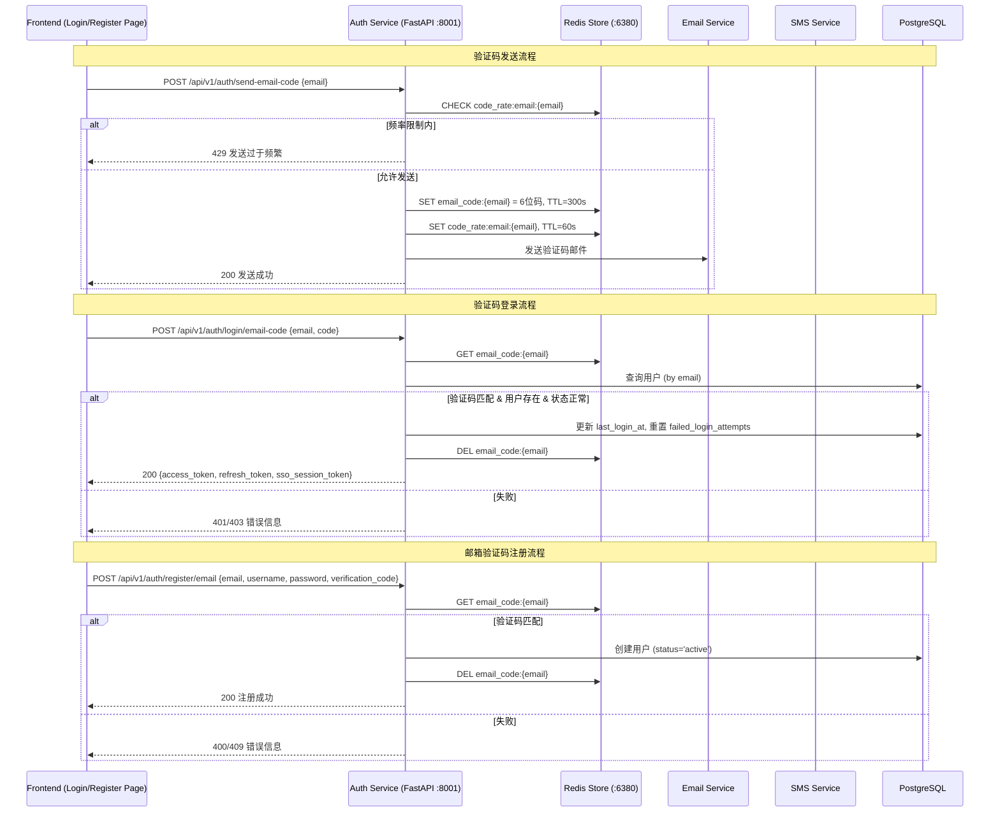
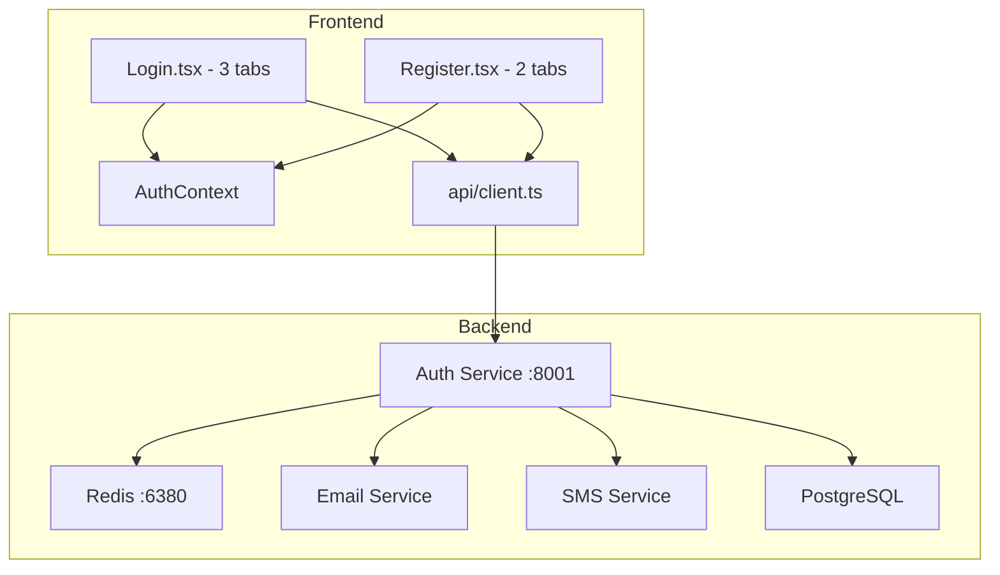

# Design Document: 验证码认证 (Verification Code Auth)

## Overview

本设计为统一身份认证平台新增验证码认证能力。在现有密码登录、手机号注册、短信验证码发送的基础上，扩展以下功能：

1. 邮箱验证码发送与存储
2. 手机验证码登录 / 邮箱验证码登录
3. 邮箱验证码注册（替代原有验证链接方式）
4. 验证码发送频率限制（60 秒）
5. 前端登录页面多方式切换（密码 / 手机验证码 / 邮箱验证码）
6. 前端注册页面（邮箱注册 / 手机注册）
7. API Client 扩展

### 设计决策

- **复用现有 Redis 存储模式**：邮箱验证码使用 `email_code:{email}` 键名，与现有 `sms_code:{phone}` 保持一致的命名风格
- **复用现有 EmailService**：新增 `send_verification_code_email` 方法，使用模板渲染验证码邮件
- **验证码登录共享 token 生成逻辑**：与密码登录返回相同的 `LoginResponse` 结构（access_token, refresh_token, sso_session_token）
- **频率限制使用独立 Redis key**：`code_rate:{type}:{target}` 与验证码 key 分离，避免覆盖时丢失频率限制状态
- **修改现有邮箱注册端点**：将 `POST /api/v1/auth/register/email` 从验证链接方式改为验证码方式，用户注册后直接激活（status='active'）

## Architecture



### 系统组件关系



## Components and Interfaces

### 后端新增/修改端点

#### 1. POST /api/v1/auth/send-email-code (新增)

发送邮箱验证码。

```python
class SendEmailCodeRequest(BaseModel):
    email: str

# Response 200
{"success": True, "message": "验证码已发送", "code": "123456" | None}  # code 仅 DEBUG 模式
# Response 400 - 邮箱格式无效
# Response 429 - 发送过于频繁
# Response 500 - 邮件发送失败
```

#### 2. POST /api/v1/auth/login/phone-code (新增)

手机验证码登录。

```python
class PhoneCodeLoginRequest(BaseModel):
    phone: str
    code: str

# Response 200 - LoginResponse (与密码登录相同)
# Response 401 - 验证码无效或用户不存在
# Response 403 - 账号锁定或未激活
```

#### 3. POST /api/v1/auth/login/email-code (新增)

邮箱验证码登录。

```python
class EmailCodeLoginRequest(BaseModel):
    email: str
    code: str

# Response 200 - LoginResponse (与密码登录相同)
# Response 401 - 验证码无效或用户不存在
# Response 403 - 账号锁定或未激活
```

#### 4. POST /api/v1/auth/register/email (修改)

修改现有邮箱注册端点，从验证链接改为验证码方式。

```python
class EmailRegisterRequest(BaseModel):
    email: str
    username: str
    password: str
    verification_code: str  # 新增字段

# Response 200 - 注册成功，用户状态直接为 'active'
# Response 400 - 验证码无效或密码不符合要求
# Response 409 - 邮箱或用户名已存在
```

#### 5. POST /api/v1/auth/send-sms (修改)

为现有短信发送端点添加频率限制。

### 后端辅助函数

```python
def check_rate_limit(redis_client, code_type: str, target: str) -> bool:
    """检查验证码发送频率限制，返回 True 表示被限制"""
    return redis_client.exists(f"code_rate:{code_type}:{target}")

def set_rate_limit(redis_client, code_type: str, target: str):
    """设置频率限制标记，60 秒 TTL"""
    redis_client.setex(f"code_rate:{code_type}:{target}", 60, "1")

def generate_verification_code() -> str:
    """生成 6 位数字验证码"""
    return ''.join([str(secrets.randbelow(10)) for _ in range(6)])

def store_verification_code(redis_client, key: str, code: str, ttl: int = 300):
    """存储验证码到 Redis"""
    redis_client.setex(key, ttl, code)

def verify_and_delete_code(redis_client, key: str, submitted_code: str) -> bool:
    """验证并删除验证码，返回是否匹配"""
    stored = redis_client.get(key)
    if not stored or stored != submitted_code:
        return False
    redis_client.delete(key)
    return True
```

### EmailService 扩展

在 `services/notification/email_service.py` 中新增方法：

```python
def send_verification_code_email(self, to_email: str, verification_code: str) -> bool:
    """发送验证码邮件"""
    return self.send_email(
        to_email=to_email,
        subject="",
        body="",
        template_name="email_verification_code",
        template_variables={
            'email': to_email,
            'verification_code': verification_code
        }
    )
```

### 前端组件

#### Login.tsx 重构

使用 Ant Design `Tabs` 组件实现三种登录方式切换：

- Tab 1: 密码登录（保留现有逻辑）
- Tab 2: 手机验证码登录（手机号 + 验证码 + 发送按钮）
- Tab 3: 邮箱验证码登录（邮箱 + 验证码 + 发送按钮）

每个验证码 Tab 包含：
- 输入框（手机号/邮箱）
- 验证码输入框
- "发送验证码" 按钮（点击后 60 秒倒计时）
- 登录按钮

#### Register.tsx 新增

使用 Ant Design `Tabs` 组件实现两种注册方式：

- Tab 1: 邮箱注册（邮箱 + 用户名 + 密码 + 确认密码 + 验证码）
- Tab 2: 手机注册（手机号 + 用户名 + 密码 + 确认密码 + 验证码）

#### useCountdown Hook

提取倒计时逻辑为自定义 Hook，供登录和注册页面复用：

```typescript
function useCountdown(seconds: number = 60): {
  countdown: number;
  isCounting: boolean;
  start: () => void;
}
```

#### API Client 扩展 (client.ts)

```typescript
export const authApi = {
  // 现有方法...
  login: (identifier: string, password: string) => ...,
  
  // 新增方法
  sendEmailCode: (email: string) =>
    client.post('/auth/send-email-code', { email }),
  sendSmsCode: (phone: string) =>
    client.post('/auth/send-sms', { phone }),
  loginWithPhoneCode: (phone: string, code: string) =>
    client.post('/auth/login/phone-code', { phone, code }),
  loginWithEmailCode: (email: string, code: string) =>
    client.post('/auth/login/email-code', { email, code }),
  registerWithEmailCode: (email: string, username: string, password: string, code: string) =>
    client.post('/auth/register/email', { email, username, password, verification_code: code }),
};
```


## Data Models

### Redis Key 设计

| Key Pattern | Value | TTL | 用途 |
|---|---|---|---|
| `email_code:{email}` | 6 位数字验证码 | 300s (5 min) | 邮箱验证码存储 |
| `sms_code:{phone}` | 6 位数字验证码 | 300s (5 min) | 短信验证码存储（已有） |
| `code_rate:email:{email}` | "1" | 60s | 邮箱验证码发送频率限制 |
| `code_rate:sms:{phone}` | "1" | 60s | 短信验证码发送频率限制 |

### Pydantic Request/Response Models

```python
# 新增请求模型
class SendEmailCodeRequest(BaseModel):
    email: str

class PhoneCodeLoginRequest(BaseModel):
    phone: str
    code: str

class EmailCodeLoginRequest(BaseModel):
    email: str
    code: str

# 修改现有模型
class EmailRegisterRequest(BaseModel):
    email: str
    username: str
    password: str
    verification_code: str  # 新增字段（替代原有的验证链接方式）
```

### 数据库模型

无需新增数据库表。现有 `User` 模型已包含所有必要字段：
- `email`, `phone`, `username`, `password_hash`
- `status` (active, locked, pending_verification)
- `failed_login_attempts`, `locked_until`, `last_login_at`

### 邮件模板

需要在 `message_templates` 表中新增一条模板记录：

```sql
INSERT INTO message_templates (name, type, subject, content) VALUES (
  'email_verification_code',
  'email',
  '验证码 - 统一身份认证平台',
  '<p>您的验证码是：<strong>{{ verification_code }}</strong></p><p>验证码有效期为 5 分钟，请勿泄露给他人。</p>'
);
```


## Correctness Properties

*A property is a characteristic or behavior that should hold true across all valid executions of a system — essentially, a formal statement about what the system should do. Properties serve as the bridge between human-readable specifications and machine-verifiable correctness guarantees.*

### Property 1: Verification code is always 6 digits and stored correctly

*For any* valid email address, when a send-email-code request is made, the code stored in Redis at key `email_code:{email}` should be exactly 6 digits (matching `^\d{6}$`) and have a TTL of approximately 300 seconds.

**Validates: Requirements 1.1**

### Property 2: Invalid email addresses are rejected

*For any* string that is not a valid email format, submitting it to the send-email-code endpoint should return HTTP 400.

**Validates: Requirements 1.4**

### Property 3: Successful verification code login returns tokens and updates user state

*For any* user with status "active" and a valid stored verification code (either phone or email), submitting the correct code to the corresponding login endpoint should return a response containing access_token, refresh_token, and sso_session_token, and the user's failed_login_attempts should be reset to 0 and last_login_at should be updated.

**Validates: Requirements 2.1, 2.2, 3.1, 3.2**

### Property 4: Verification codes are single-use

*For any* successful verification code operation (login or registration), the used code should be deleted from Redis, and a subsequent attempt to use the same code should fail.

**Validates: Requirements 2.3, 3.3, 4.2**

### Property 5: Non-matching or expired codes are rejected

*For any* verification code login or registration request where the submitted code does not match the stored code (or no code exists), the system should return an error (HTTP 401 for login, HTTP 400 for registration) with message "验证码无效或已过期".

**Validates: Requirements 2.4, 3.4, 4.3**

### Property 6: Non-existent users are rejected for code login

*For any* phone number or email address that does not correspond to an existing user account, submitting a verification code login request should return HTTP 401 with message "用户不存在".

**Validates: Requirements 2.5, 3.5**

### Property 7: Account status enforcement for code login

*For any* user with status "locked" or "pending_verification", verification code login (both phone and email) should be rejected with HTTP 403, regardless of whether the submitted code is correct.

**Validates: Requirements 2.6, 2.7, 3.6, 3.7**

### Property 8: Email registration creates active user and deletes code

*For any* valid registration data (unique email, unique username, strong password, matching verification code), the created user should have status "active" and the verification code should be deleted from Redis.

**Validates: Requirements 4.1, 4.2**

### Property 9: Registration uniqueness constraints

*For any* email or username that already exists in the database, attempting to register with that email or username should return HTTP 409 with the appropriate error message.

**Validates: Requirements 4.4, 4.5**

### Property 10: Rate limiting prevents rapid code sending

*For any* target (email or phone), after a successful code send, a subsequent send request within 60 seconds should return HTTP 429 with message "发送过于频繁，请60秒后重试".

**Validates: Requirements 7.1, 7.2, 7.3**

### Property 11: Password mismatch validation

*For any* two different strings used as password and confirm password on the registration form, the form should display the validation error "两次密码输入不一致" and prevent submission.

**Validates: Requirements 6.6**

## Error Handling

### 后端错误处理

| 场景 | HTTP Status | Error Message | 处理方式 |
|---|---|---|---|
| 邮箱格式无效 | 400 | "邮箱格式不正确" | 使用 email-validator 或正则校验 |
| 手机号格式无效 | 400 | "手机号格式不正确" | 复用现有 `validate_phone` |
| 验证码无效/过期 | 401 (login) / 400 (register) | "验证码无效或已过期" | Redis GET 返回 None 或不匹配 |
| 用户不存在 | 401 | "用户不存在" | DB 查询无结果 |
| 账号锁定 | 403 | "账号已被锁定，请在{N}分钟后重试" | 检查 `locked_until` 字段 |
| 账号未激活 | 403 | "账号未激活" | 检查 `status == 'pending_verification'` |
| 邮箱已注册 | 409 | "邮箱已被注册" | DB 唯一约束检查 |
| 用户名已使用 | 409 | "用户名已被使用" | DB 唯一约束检查 |
| 发送频率限制 | 429 | "发送过于频繁，请60秒后重试" | Redis EXISTS 检查 rate limit key |
| 邮件发送失败 | 500 | "邮件发送失败，请稍后重试" | EmailService.send_email 返回 False |
| 密码强度不足 | 400 | 具体描述（如"密码长度不足8位"） | 复用现有 `validate_password` |

### 前端错误处理

- 表单验证错误：使用 Ant Design Form 的 `rules` 进行实时校验，阻止无效请求
- API 错误：通过 `message.error()` 显示后端返回的 `detail` 字段
- 网络错误：显示通用错误提示 "网络错误，请稍后重试"
- 倒计时状态：发送验证码失败时不启动倒计时，允许用户重试

## Testing Strategy

### 属性测试 (Property-Based Testing)

使用 **Hypothesis** (Python) 进行后端属性测试，使用 **fast-check** (TypeScript) 进行前端属性测试。

每个属性测试配置最少 100 次迭代。每个测试必须通过注释引用设计文档中的属性编号。

注释格式：`# Feature: verification-code-auth, Property {N}: {property_text}`

每个 Correctness Property 对应一个属性测试用例：

| Property | 测试策略 | 生成器 |
|---|---|---|
| P1: 验证码格式与存储 | 生成随机有效邮箱，调用发送接口，检查 Redis 中的值 | `st.emails()` |
| P2: 无效邮箱拒绝 | 生成随机非邮箱字符串，验证返回 400 | `st.text().filter(not_valid_email)` |
| P3: 登录成功返回 tokens | 生成随机用户+验证码，验证响应结构 | 自定义 user+code strategy |
| P4: 验证码单次使用 | 生成随机用户+验证码，使用后再次使用验证失败 | 自定义 user+code strategy |
| P5: 非匹配验证码拒绝 | 生成随机用户+不匹配的验证码，验证返回错误 | `st.tuples(valid_code, different_code)` |
| P6: 不存在用户拒绝 | 生成随机不存在的手机号/邮箱，验证返回 401 | `st.text()` filtered |
| P7: 账号状态强制检查 | 生成 locked/pending 状态用户，验证返回 403 | `st.sampled_from(['locked', 'pending_verification'])` |
| P8: 注册创建活跃用户 | 生成随机有效注册数据，验证用户状态为 active | 自定义 registration strategy |
| P9: 注册唯一性约束 | 生成已存在的邮箱/用户名，验证返回 409 | 从已有数据中采样 |
| P10: 频率限制 | 连续发送两次，验证第二次返回 429 | `st.emails()` |
| P11: 密码不匹配验证 | 生成两个不同的密码字符串，验证前端显示错误 | `st.tuples(st.text(), st.text()).filter(lambda x: x[0] != x[1])` |

### 单元测试

单元测试聚焦于具体示例和边界情况，与属性测试互补：

**后端单元测试 (pytest)**：
- 验证码发送成功的完整流程（含 EmailService mock）
- DEBUG 模式下响应包含验证码
- 邮件发送失败返回 500
- 各登录方式的成功/失败具体场景
- 注册端点的各种错误场景
- 频率限制的边界情况（恰好 60 秒后允许重发）

**前端单元测试 (Vitest + React Testing Library)**：
- Login 页面三个 Tab 的渲染和切换
- Register 页面两个 Tab 的渲染和切换
- 发送验证码按钮的倒计时行为
- 表单验证规则（邮箱格式、手机号格式、密码匹配）
- 登录/注册成功后的导航行为
- Login 和 Register 页面之间的链接
- API Client 各方法调用正确的端点
